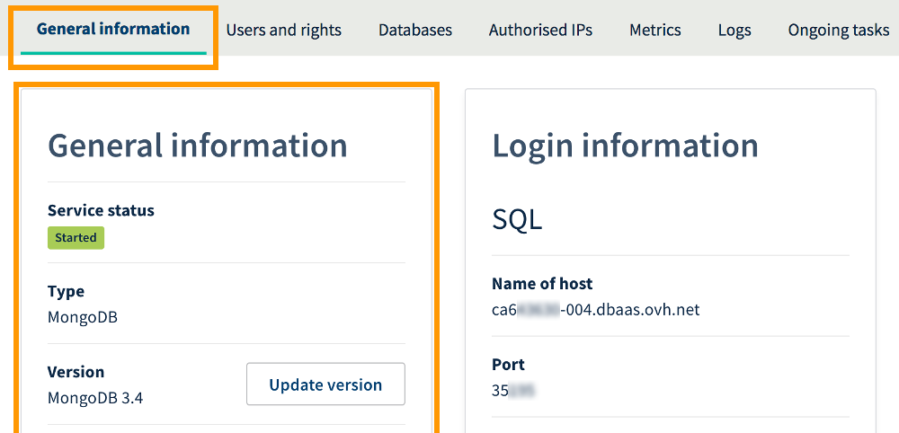
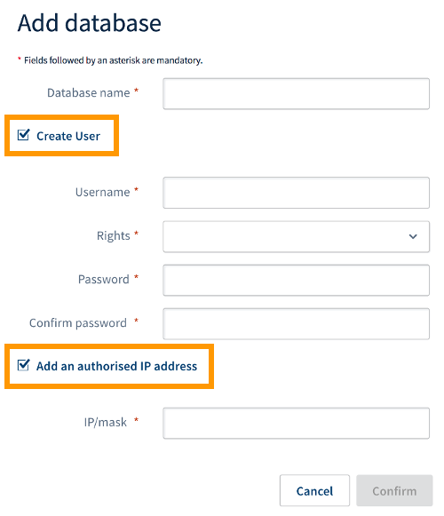

**Dernière mise à jour le 26/03/2018**

## Objectif

La solution CloudDB permet de bénéficier d’une instance de bases de données, dont les ressources sont dédiées et garanties. Ce service offre davantage de performances et de flexibilité ; il s’adresse généralement à des clients ayant des besoins spécifiques.

**Découvrez comment bien débuter avec la solution CloudDB.**

## Prérequis

- Disposer d'une [instance CloudDB](https://www.ovh.com/fr/cloud/cloud-databases/){.external}.
- Être connecté à votre [espace client OVH](https://www.ovh.com/auth/?action=gotomanager){.external}.

## En pratique

### Visionner les informations générales de l'instance

Dans la barre de services à gauche de votre [espace client OVH](https://www.ovh.com/auth/?action=gotomanager){.external}, rendez-vous dans la section `Bases de données`{.action}, puis sur l'instance concernée. Assurez-vous d'être bien positionné sur l'onglet `Informations générales`{.action}.

> [!primary]
>
> Le nom du service CloudDB dans votre espace client OVH contient une partie de votre référence client et se termine par trois chiffres (001 pour le premier service CloudDB installé, 002 pour le deuxième, etc.).
>

Vous pouvez y consulter les informations importantes concernant votre instance. Nous vous invitons à prendre quelques instants afin de vous assurer que les données affichées sont correctes ou correspondent aux indications ci-dessous.

|Information|Détails|
|---|---|
|État du service|Affiche notamment si l'instance est démarrée, en cours de redémarrage ou suspendue. Votre instance doit être démarrée pour pouvoir y réaliser des actions.|
|Type|Affiche le système de bases de données utilisée par le serveur.|
|Version|Affiche la version du système de bases de données utilisée par le serveur. Veillez à la compatibilité de votre site avec la version choisie.|
|RAM|Affiche la mémoire vive disponible pour votre instance ainsi que les éventuels dépassements de mémoire. Votre instance CloudDB dispose de ressources dédiées et garanties : sa mémoire RAM. Si besoin, vous pouvez faire évoluer cette dernière et être prévenu si vous consommez toutes les ressources mémoire de votre instance.|
|Infrastructure|Affiche l'infrastructure utilisée par votre instance. Il s'agit d'une information inhérente à l'infrastructure d'OVH.|
|Datacenter|Affiche le centre de données dans lequel l'instance a été créée. Assurez-vous que le datacenter de votre instance est le même que celui de l'hébergement web OVH où votre site internet est – ou sera – hébergé.|
|Host|Affiche le serveur OVH dans lequel votre instance est créée. Il s'agit d'une information inhérente à l'infrastructure d'OVH et peut être utilisée dans nos communications liées aux [incidents OVH](http://travaux.ovh.net/){.external}.|

{.thumbnail}

### Création d'une base de données

> [!primary]
>
> Cette étape ne s'applique pas au système de bases de données Redis.
>

Pour créer votre première base de données sur votre instance CloudDB, cliquez sur l'onglet `Bases de données`{.action} puis sur le bouton `Ajouter une base de données`{.action}.

{.thumbnail}

Sur la fenêtre qui s'affiche, et conjointement à la création de la base de données, vous pouvez choisir de :

-  **créer un utilisateur** : ce dernier pourra effectuer des requêtes sur votre base de données (comme la lecture, l'insertion ou la suppression de données) ;

- **ajouter une adresse IP autorisée** : les requêtes provenant de cette dernière seront autorisées à accéder à vos bases de données.

Selon votre choix, complétez maintenant les informations demandées puis cliquez sur `Valider`{.action}.

|Information|Description|
|---|---|
|Nom de la base|Il s'agit du nom de votre future base de données.|
|Nom d'utilisateur|Il s'agit de l'utilisateur qui pourra se connecter à votre base de données et y effectuer des requêtes (facultatif si la case « *Créer un utilisateur* » n'est pas cochée).|
|Droits|Il s'agit des droits qui seront associés à l'utilisateur ; pour une utilisation classique, sélectionnez `Administrateur`{.action} (facultatif si la case « *Créer un utilisateur* » n'est pas cochée).|
|Mot de passe|Sélectionnez un mot de passe, puis confirmez ce dernier (facultatif si la case « *Créer un utilisateur* » n'est pas cochée).|
|IP/masque|Il s'agit de l'adresse IP ou du masque d'IP du ou des serveurs qui seront autorisés à accéder à vos bases de données (facultatif si la case « *Ajouter une adresse IP autorisée* » n'est pas cochée).|

> [!warning]
>
> Pour des raisons de sécurité, nous vous invitons à respecter les conditions indiquées lors de l'enregistrement des informations.
>

{.thumbnail}

### Création d'un utilisateur

> [!primary]
>
> Cette étape ne s'applique pas au système de bases de données Redis.
>

Si vous avez créé l'utilisateur en même temps que votre base de données lors de la manipulation précédente, cette étape est facultative. Cependant, pour un projet plus spécifique, il peut s'avérer nécessaire que plusieurs utilisateurs habilités interviennent sur votre base. Par exemple, l'un des utilisateurs associés à une base de données peut bénéficier des droits de lecture et d'écriture tandis que l'autre jouira uniquement d'un droit de lecture.

Si votre projet ne nécessite pas un utilisateur additionnel, vous pouvez passer à la manipulation suivante. Dans le cas contraire, pour créer un utilisateur sur votre instance CloudDB, cliquez sur l'onglet `Utilisateurs et droits`{.action} puis sur le bouton `Ajouter un utilisateur`{.action}.

{.thumbnail}

Sur la fenêtre qui s'affiche, complétez maintenant les informations demandées puis cliquez sur `Valider`{.action}.

|Information|Description|
|---|---|
|Nom d'utilisateur|Il s'agit de l'utilisateur qui pourra se connecter à votre instance. Vous pourrez ensuite lui associer des droits sur votre base de données.|
|Mot de passe|Sélectionnez un mot de passe puis confirmez ce dernier.|

> [!warning]
>
> Pour des raisons de sécurité, nous vous invitons à respecter les conditions indiquées lors de l'enregistrement des informations.
>

{.thumbnail}

Dès qu'un utilisateur est créé, il est nécessaire de lui attribuer des droits pour lui permettre d'effectuer des actions sur votre base de données (comme la lecture, l'insertion ou la suppression de données). Pour cela, cliquez sur le logo en forme de roue dentée, puis sur `Gérer les droits`{.action}. Sur la nouvelle page, sélectionnez le droit souhaité en cliquant dessus. Pour une utilisation classique, choisissez `Administrateur`{.action}.

{.thumbnail}

### Importation d'une base de données

> [!primary]
>
> Cette étape s'applique si vous souhaitez importer une sauvegarde d'une base de données déjà existante. Si ce n'est pas le cas, passez à la manipulation suivante.
>

Il existe plusieurs techniques pour importer une base de données. Un outil est notamment à votre disposition depuis l'espace client OVH et nous allons nous intéresser à cette méthode. Vous pouvez cependant en utiliser une autre, selon vos préférences et connaissances.

Les étapes ci-dessous décrivent comme importer une base de données grâce à l'outil disponible dans l'espace client OVH.

- **Étape 1 : accéder à l'interface d'importation**

Depuis l'onglet `Bases de données`{.action}, cliquez sur le pictogramme en forme de roue dentée puis sur `Importer un fichier`{.action}. Sur la fenêtre qui s'affiche, cochez la case `Importer un nouveau fichier`{.action} puis cliquez sur `Suivant`{.action}.

{.thumbnail}

- **Étape 2 : sélectionner et envoyer le fichier de sauvegarde**

Renseignez un nom de fichier, qui vous permettra d'identifier cette sauvegarde plus tard si vous souhaitez de nouveau la restaurer. Ensuite, à côté de **Fichier**, sélectionnez le fichier de sauvegarde de la base de données sur votre ordinateur, puis cliquez sur `Envoyer`{.action}. Patientez le temps que l'interface vous indique que le fichier a été envoyé avec succès, puis cliquez sur le bouton `Suivant`{.action}.

{.thumbnail}

- **Étape 3 : lancer l'importation de la base de données**

Choisissez finalement d'appliquer ou non les options additionnelles décrites ci-dessous, puis cliquez sur `Confirmer`{.action}.

|Options additionnelles|Description|
|---|---|
|Vider la base de données actuelle|Le contenu présent dans la base de données sera intégralement supprimé puis remplacé par celui de votre sauvegarde.|
|Envoyer un e-mail à la fin de l'importation|Une notification par e-mail vous sera envoyée lorsque l'importation de la base de données sera effectuée.|

{.thumbnail} 

### Autoriser une adresse IP

Afin que l’accès à votre instance CloudDB fonctionne, il est obligatoire d'indiquer les IP ou plages d'IP pouvant se connecter à vos bases de données. Pour cela, cliquez sur l'onglet `IP autorisées`{.action} puis sur le bouton `Ajouter une adresse IP/masque`{.action}.

{.thumbnail}

Sur la fenêtre qui s'affiche, indiquez l'adresse IP ou le masque que vous désirez autoriser dans `IP/masque`{.action} puis ajoutez une description si vous le souhaitez. Décidez ensuite si vous voulez donner accès uniquement aux bases de données ou au SFTP. Enfin, cliquez sur `Valider`{.action}.

{.thumbnail}

### Lier votre site à la base de données

Maintenant que votre base de données est créée, qu'un ou plusieurs utilisateurs disposent de droits sur cette dernière et qu'au minimum une adresse IP a été autorisée sur votre instance CloudDB, il ne reste plus qu'à lier votre site à votre base de données. Cette étape peut s'effectuer de plusieurs manières, en fonction du site ou du CMS (WordPress, Joomla!, etc.) utilisé, ainsi que de l'étape à laquelle vous vous trouvez si vous installez un site web.

Afin de pouvoir mener à bien cette manipulation, vous devez quoi qu'il arrive être en possession de ces cinq informations :

|Information|Description|
|---|---|
|Nom de la base de données|Il s'agit du nom que vous avez défini lors de la création de la base de données. Vous pouvez retrouver toutes vos bases de données créées sur votre instance CloudDB depuis l'onglet `Bases de données`{.action}.|
|Nom d'utilisateur|Il s'agit du nom d'utilisateur que vous avez défini lors de la création de la base de données ou d'un éventuel utilisateur additionnel que vous auriez ajouté. Vous pouvez retrouver tous les utilisateurs créés sur votre instance CloudDB depuis l'onglet `Utilisateurs et droits`{.action}.|
|Mot de passe de l'utilisateur|Il s'agit du mot de passe, lié à l'utilisateur, que vous avez défini lors des manipulations précédentes.|
|Nom d'hôte du serveur|Il s'agit du serveur à renseigner afin que votre site puisse se connecter à votre base de données. Cette information est accessible dans votre espace client, depuis le cadre **Informations de connexion** de l'onglet `Informations générales`{.action}.|
|Port du serveur|Il s'agit du port de connexion à votre instance CloudDB pour que votre site puisse se connecter à votre base de données. Cette information est accessible dans votre espace client, depuis le cadre **Informations de connexion** de l'onglet `Informations générales`{.action}.|

> [!warning]
>
> Dans de rares cas, le champ `port`{.action} peut ne pas être proposé dans la configuration de votre site. Si tel est le cas, vous devrez ajouter ce champ après le nom d'hôte de votre serveur en les séparant de *:* (par exemple : nomhôte:port).
>

{.thumbnail}

## Aller plus loin

Échangez avec notre communauté d'utilisateurs sur <https://community.ovh.com>.