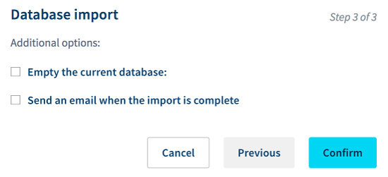
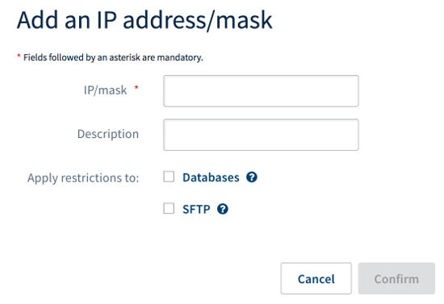
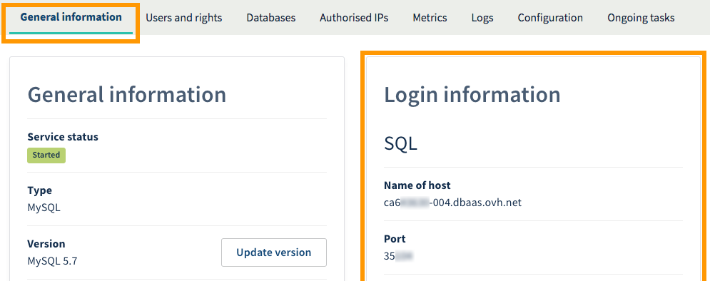

**Ultimo aggiornamento: 12/07/2018**

## Obiettivo

CloudDB consente di usufruire di un’istanza database, con risorse dedicate e garantite. Questo servizio offre maggiori performance e flessibilità, per venire incontro a clienti con esigenze specifiche.

**Scopri come iniziare a utilizzare la soluzione CloudDB**. 

## Prerequisiti

- Disporre di un’[istanza CloudDB](https://www.ovh.it/cloud/cloud-databases/){.external}
- Avere accesso allo [Spazio Cliente OVH](https://www.ovh.com/auth/?action=gotomanager){.external}

## Procedura

### Visualizza le informazioni generali dell'istanza

Accedi allo [Spazio Cliente OVH](https://www.ovh.com/auth/?action=gotomanager){.external}, clicca su `Database`{.action} nel menu a sinistra e seleziona la tua istanza CloudDB. Assicurati di trovarti nella scheda `Informazioni generali`{.action}.

> [!primary]
>
> Il nome del servizio CloudDB nello Spazio Cliente OVH contiene una parte del tuo identificativo cliente e termina con tre numeri (001 per il primo servizio CloudDB installato, 002 per il secondo, ecc...).
>

In questa interfaccia puoi visualizzare anche le informazioni principali relative alla tua istanza. Ti consigliamo di verificarne la correttezza e assicurarti che corrispondano alle descrizioni indicate di seguito:

|Informazione|Descrizione|
|---|---|
|Stato del servizio|Indica se l’istanza è attiva, in stato di riavvio o sospesa. Per poter eseguire operazioni, l’istanza deve essere attiva.|
|Tipo|Indica il sistema di database utilizzato dal server.|
|Versione|Indica la versione del sistema di database utilizzata dal server. Ti ricordiamo di verificare la compatibilità del tuo sito con la versione scelta.|
|RAM|Indica la memoria disponibile sulla tua istanza e segnala l’eventuale raggiungimento della soglia limite. La tua istanza CloudDB dispone di risorse dedicate e garantite: la memoria RAM.  Se necessario, è possibile aumentarla e ricevere una notifica in caso di utilizzo di tutte le risorse disponibili.|
|Infrastruttura|Indica l’infrastruttura utilizzata dall’istanza. Questa informazione è relativa alla piattaforma di OVH.|
|Datacenter|Indica il datacenter in cui è stata creata l’istanza. Assicurati che corrisponda a quello dell’hosting Web OVH in cui è (o sarà) ospitato il tuo sito.|
|Host|Indica il server OVH in cui è stata creata l’istanza. Questa informazione è relativa all'infrastruttura OVH e, in caso di [incidenti](http://status.ovh.net/){.external}, può essere presente nelle nostre comunicazioni.|

{.thumbnail}

### Crea un database

> [!primary]
>
> Questo step non si applica al sistema di database Redis.
>

Per creare il tuo primo database sull’istanza CloudDB, clicca sulla scheda `Database`{.action} e poi sul pulsante `Aggiungi database`{.action}.

{.thumbnail}

Nella finestra che appare, oltre alla creazione del database, puoi scegliere di:

-  **creare un utente**: quest’ultimo potrà effettuare delle richieste sul tuo database (come la lettura, l’inserimento o la cancellazione dei dati); 

- **aggiungere un indirizzo IP autorizzato**: le richieste provenienti dall’IP aggiunto saranno autorizzate ad accedere ai tuoi database.

In base alla tua scelta, completa le informazioni richieste e poi clicca su `Conferma`{.action}. 

|Informazione|Descrizione|
|---|---|
|Nome del database|È il nome del tuo futuro database.|
|Nome utente|È l’utente che potrà connettersi al tuo database ed effettuare richieste (opzionale se non hai selezionato la voce *Creare un utente*).|
|Permessi|Sono le autorizzazioni che saranno assegnate all’utente; per un utilizzo standard, seleziona `Amministratore`{.action} (facoltativo se non hai selezionato la voce *Creare un utente*).|
|Password|Indica una password, poi confermala (opzionale se non hai selezionato la voce *Creare un utente*).|
|IP/maschera|È l’indirizzo IP o della maschera d’IP del server che saranno autorizzati ad accedere ai tuoi database (opzionale se non hai selezionato la voce *Aggiungere un indirizzo IP autorizzato*).|

> [!warning]
>
> Per motivi di sicurezza, durante l’inserimento dei dati ti invitiamo a rispettare i requisiti richiesti.
>

{.thumbnail}

### Crea un utente 

> [!primary]
>
> Questo step non si applica al sistema di database Redis.
>

Se hai creato l'utente insieme al database, questo step è opzionale. Per un progetto più complesso, invece, potrebbe essere necessario autorizzare più utenti a lavorare sullo stesso database. Ad esempio, uno potrebbe disporre dei permessi di lettura e scrittura mentre l’altro dei permessi di sola lettura.

Se un utente aggiuntivo non è necessario al tuo progetto, puoi passare allo step successivo. In caso contrario, per creare un utente sulla tua istanza CloudDB, clicca sulla scheda `Utenti e diritti`{.action} e poi sul pulsante `Aggiungi un utente`{.action}.

{.thumbnail}

Inserisci le informazioni richieste nella finestra che appare e poi clicca su `Conferma`{.action}.

|Informazione|Descrizione|
|---|---|
|Nome utente|È l'utente che sarà in grado di accedere alla tua istanza. È possibile assegnargli i permessi nel passaggio successivo.|
|Password|Seleziona una password e poi confermala. |

> [!warning]
>
> Per motivi di sicurezza, durante l’inserimento dei dati ti invitiamo a rispettare i requisiti richiesti.
>

{.thumbnail}

Una volta creato l’utente è necessario assegnargli i permessi per autorizzarlo a effettuare operazioni sul database (come lettura, inserimento e cancellazione dei dati): clicca sull’icona a forma di ingranaggio e seleziona `Gestisci i diritti`{.action}. Si apre una nuova pagina in cui puoi scegliere i permessi da assegnare. Per un utilizzo standard, scegli Amministratore.

{.thumbnail}

### Importa un database

> [!primary]
>
> Questo step mostra come importare un backup di un database già esistente. Se non è il tuo caso, passa allo step successivo.
>

Esistono diverse tecniche per importare un database e OVH mette anche a disposizione un tool nello Spazio Cliente. Puoi comunque utilizzare la modalità che preferisci in base alle tue conoscenze.

Negli step successivi descriviamo come importare un database attraverso lo Spazio Cliente OVH.

- **Step 1: accedi all’interfaccia d’importazione**

Seleziona la scheda `Database`{.action}, clicca sull’icona a forma di ingranaggio e poi su `Importa un file`{.action}. Nella nuova finestra, seleziona l’opzione `Importa un nuovo file`{.action} e clicca su `Continua`{.action}.

{.thumbnail}

- **Step 2: seleziona e invia il file di backup**

Assegna un nome al file che ti permetterà di identificare questo backup in futuro nel caso in cui volessi ripristinarlo. In seguito, accanto a **File**, seleziona il file di backup del database sul tuo computer, poi clicca su `Continua`{.action}. Attendi la conferma di invio del file e poi clicca sul pulsante `Continua`{.action}.

{.thumbnail}

- **Step 3: avvia l'importazione del database**

A questo punto scegli se applicare o meno le seguenti opzioni aggiuntive, poi clicca su `Conferma`{.action}.

|Opzioni aggiuntive|Descrizione|
|---|---|
|Svuota il database attuale|Il contenuto del database viene totalmente eliminato e sostituito da quello del backup.|
|Ricevi una email al termine dell’importazione|Una volta completata l'importazione del database, riceverai una notifica via email.|

{.thumbnail} 

### Autorizza un indirizzo IP

Affinché l’accesso alla tua istanza CloudDB funzioni correttamente, è fondamentale indicare gli IP o i blocchi di IP che possono connettersi ai tuoi database. Per fare ciò, clicca sulla scheda `IP autorizzati`{.action} e poi sul pulsante `Aggiungere un IP/mask`{.action}.

{.thumbnail}

Nella finestra che appare indica l’indirizzo IP o la mask da autorizzare in `IP/mask`{.action} e poi, se vuoi, aggiungi una descrizione. Decidi se vuoi fornire un accesso soltanto ai database o anche via SFTP. Infine clicca su `Conferma`{.action}.

{.thumbnail}

### Collega il tuo sito al database

Ora che il tuo database è stato creato e che uno o più utenti dispongono dei permessi necessari per effettuare l’accesso, non resta che collegare il sito al database. Questa operazione si può eseguire in diversi modi, a seconda del sito e del CMS utilizzato (WordPress, Joomla!, ecc…) o, in caso in cui tu stia installando un sito, dello step in cui ti trovi.

In ogni caso, è necessario disporre di queste cinque informazioni:

|Informazione|Descrizione|
|---|---|
|Nome del database|È il nome assegnato in fase di creazione del database. Puoi trovare tutti i database creati sulla tua istanza CloudDB dalla scheda `Database`{.action}.|
|Nome utente|È il nome utente definito durante la creazione del database o degli eventuali utenti aggiuntivi. Puoi trovare tutti gli utenti creati sulla tua istanza CloudDB dalla scheda `Utenti e diritti`{.action}.|
|Password dell’utente|È la password associata all'utente definita durante le operazioni precedenti.|
|Hostname del server|È l’indirizzo del server utilizzato dal tuo sito per connettersi al tuo database. Questa informazione è disponibile nello Spazio Cliente OVH, scheda **Informazioni generali** > `Informazioni di login`{.action}.|
|Porta del server|È la porta di connessione all'istanza CloudDB, che permette l’accesso del tuo sito al database. Questa informazione è disponibile nello Spazio Cliente OVH, scheda **Informazioni generali** > `Informazioni di login`{.action}.|

> [!warning]
>
> Il campo `Porta`{.action} potrebbe non essere disponibile nella configurazione del tuo sito. In questo caso, è necessario aggiungerlo dopo l’hostname del server, separandolo con il simbolo *:* (ad esempio hostname:porta).
>

{.thumbnail}

## Per saperne di più

Contatta la nostra Community di utenti all’indirizzo <https://www.ovh.it/community/>.