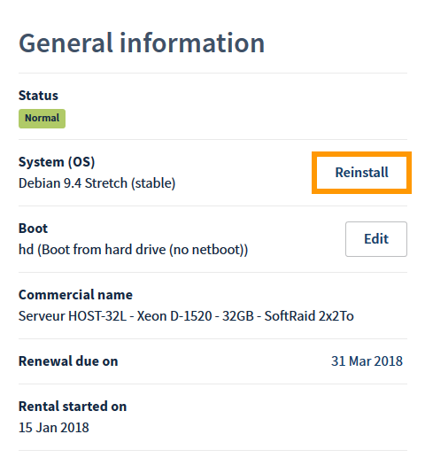
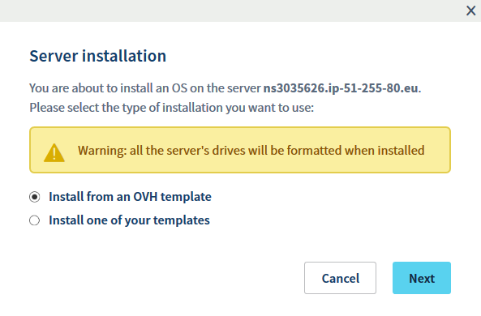
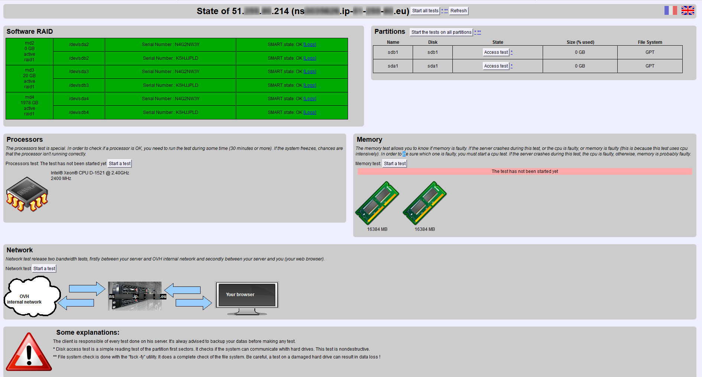

**Last updated 15th May 2018**

## Objective

A dedicated server is a physical server located in one of our datacentres. Unlike Web Hosting plans (described as “shared”), which are technically managed by OVH, you are fully responsible for administrating your dedicated server.

**This guide will give you a few tips to help you manage your newly-delivered dedicated server.**


## Requirements

* A [dedicated server](https://www.ovh.ie/dedicated_servers/){.external} in your [OVH Control Panel](https://www.ovh.com/auth/?action=gotomanager){.external} with root to via SSH (Linux)
* A [dedicated server](https://www.ovh.ie/dedicated_servers/){.external} in your [OVH Control Panel](https://www.ovh.com/auth/?action=gotomanager){.external} with administrative access via remote desktop (Windows).


## Instructions

### Logging on to your server

#### Linux

When your dedicated server is first set up, you will get an email containing your password for root access. Root access lets you connect to your server via SSH, which is a secure communication protocol. You can access your server through a command terminal (Linux or MAC), or through third-party software on Windows (e.g.: PuTTy).

Once you have opened the terminal, type the following command to log on to your server, replacing the text after the @ symbol with the information required (IP address or server reference name). Your server's reference name will always start with *ns*.

**Example using an IP address**

```sh
ssh root@IPv4_of_your_server
```

**Example using a server reference**

```sh
ssh root@your_server_reference_name
```

#### Windows

When your dedicated server is first set up, you will get an email containing your password for administrative (root) access. You will need to use these credentials to connect to the server via RDP. Once you've connected, Windows will guide you through an intial setup.

### Installing or reinstalling your dedicated server

Go to your server's page in your [control panel](https://www.ovh.com/auth/?action=gotomanager){.external} and click the `Reinstall`{.action} button.

{.thumbnail}

On the next screen, select either `Install from an OVH template`{.action} (to use one of our installation templates) or `Install one of your templates`{.action} (to use your own), then click `Next`{.action}.

{.thumbnail}

Select the operating system you want to install and click `Next`{.action}.

{.thumbnail}

Follow the rest of the instructions on the screen, then click `Confirm`{.action} to proceed with the installation.


> [!primary]
>
> Some operating systems or platforms, such as Plesk and Windows, require a licence to be purchased prior to installation. You can buy this [licence from OVH](https://www.ovh.ie/dedicated_servers/distributions/){.external}, or from a reseller. You will then need to integrate it manually, through the operating system itself, or through your [control panel](https://www.ovh.com/auth/?action=gotomanager){.external}. You can manage your licences via the [control panel](https://www.ovh.com/auth/?action=gotomanager){.external}, under `Dedicated`{.action}, then `Licences`{.action}. In this section, you can also order licences (via the `Order`{.action} button on the right), or add your own SPLA Windows or SPLA SQL server licence (via the `Add an SPLA licence`{.action} button on the right).
> 


### Securing your dedicated server

As explained in the “Objective” section of this guide, you are the administrator of your dedicated server. As such, you are responsible for your data and its security. However, the following tips will help you to secure it:

* Keep your operating system up to date
* Keep your software up to date
* Change your default SSH port (port 22) to another port
* Change your root password
* Create a new system user with restricted access for day-to-day use

### Network configuration

#### Network bridging

Network bridging is the action taken by network equipment to create an aggregate network from either two or more communication networks, or two or more network segments. Bridging is distinct from routing, which allows the networks to communicate independently while remaining separate.

The Network Bridge configuration is most commonly used in the context of virtualisation, to allow each Virtual Machine to have its own public IP address.

For more information on network bridging, please refer to our guide: [Network Bridging](https://docs.ovh.com/ie/en/dedicated/network-bridging/){.external}.

#### IP aliasing

IP aliasing is the process of associating two or more IP addresses to the same network interface. This allows your server to establish multiple connections to a network, each serving a different purpose.

For detailed instructions on how to configure IP aliasing, please refer to [this guide](https://docs.ovh.com/ie/en/dedicated/network-ipaliasing/){.external}.

#### IPv6 configuration

All OVH dedicated servers are delivered with a /64 IPv6 block. To use the addresses in this block, you will need to make some network configuration changes. Please refer to our guide: [IPv6 Configuration](https://docs.ovh.com/gb/en/dedicated/network-ipv6/){.external}.


### Troubleshooting

OVH deploys all its dedicated servers with an IPMI (Intelligent Platform Management Interface) console, which runs in your browser or from a Java applet, and enables you to connect directly to your server, even if it has no network connection. This makes it good for troubleshooting issues that may have taken your server offline.

For more information, please refer to our guide: [Using the IPMI with dedicated servers](https://docs.ovh.com/ie/en/dedicated/use-ipmi-dedicated-servers/){.external}.

### Rescue mode

If there's ever an issue with your server, the first troubleshooting step you should take is to reboot your server into rescue mode. To activate rescue mode, log in to your [OVH control panel](https://www.ovh.com/auth/?action=gotomanager){.external} and go to your server's page. Then go to `Server Status`{.action} > `General information`{.action} > `Boot`{.action}. Click the `Edit`{.action} button to change the boot mode.

{.thumbnail}

On the next screen, select `Boot on rescue mode`{.action} and select `rescue64-pro`{.action} from the dropdown list. Type your email address in the text field, then click `Next`{.action}.

{.thumbnail}


Confirm your options on the next screen and then reboot your server to apply the changes.

{.thumbnail}


Your server will now reboot into rescue mode, and you will receive the credentials for logging in via the email address you provided. To exit rescue mode, simply change the boot mode back to boot on the hard disk, then reboot your server.

To learn more about how you can use rescue mode to resolve issues with your server, please refer to our guide: [Rescue mode](https://docs.ovh.com/ie/en/dedicated/rescue_mode/){.external}.


#### Hardware diagnosis

The hardware tests available in rescue mode can help you to diagnose any hardware faults that may be causing problems with your server.

After logging in to rescue mode's web interface, you will be able to run tests on the following hardware components:

* RAM
* Hard disks
* RAID array
* Processor
* Network connection

#### Rescue mode web interface

{.thumbnail}

## Go further

Join our community of users on <https://community.ovh.com/en/>.