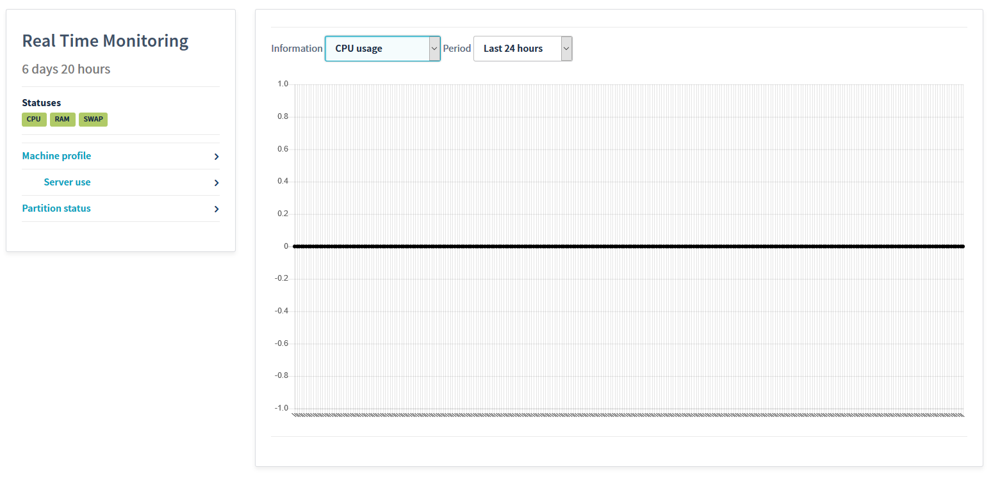

**Last updated 17th July 2018**

## Objective

With Real Time Monitoring (RTM), you can partially monitor your server and its activity. In your Control Panel, you will find information on the CPU (Central Processing Unit), RAM (Random Access Memory), open ports, etc. To view this information, you need to install the RTM package.

**This guide will explain how to install RTM on Linux or Windows**

## Requirements

- administrative (root) access to the server via SSH (Linux only)
- administrator access to your server via remote desktop protocoal (Windows only)
- access to the [OVH Control Panel](https://www.ovh.com/auth/?action=gotomanager){.external}.

## Instructions

Once you have installed the RTM via your Control Panel, you can monitor your server in the `Dedicated`{.action} section. On the main page for your server, you can find the monitoring information under `Real Time Monitoring`:

{.thumbnail}

{.thumbnail}

{.thumbnail}

> [!primary]
>
> Some firewall restrictions could prevent your infrastructure from being monitored, even though you have added the RTM. Don’t forget to give OVH monitoring IP addresses access to your server. You can find more details [here](https://docs.ovh.com/gb/en/dedicated/monitoring-ip-ovh/){.external}.
> 

### Installing RTM in Linux

Once you have logged in via SSH on your server, simply run the following command:

```sh
wget ftp://ftp.ovh.net/made-in-ovh/rtm/install_rtm.sh -O install_rtm.sh ; sh install_rtm.sh
```

### Installing RTM in Windows

Once you are logged in to the remote desktop, install ActivePerl if you have never installed RTM before. You can download it here: <http://www.activestate.com/activeperl/>

Next, download and install the latest version of RTM here: <ftp://ftp.ovh.net/made-in-ovh/rtm/windows/>.

Finally, right-click on the file and then click `Run as administrator`{.action}

## Go further

[IP addresses for OVH monitoring](https://docs.ovh.com/gb/en/dedicated/monitoring-ip-ovh/){.external}

Join our community of users on <https://community.ovh.com/en/>.