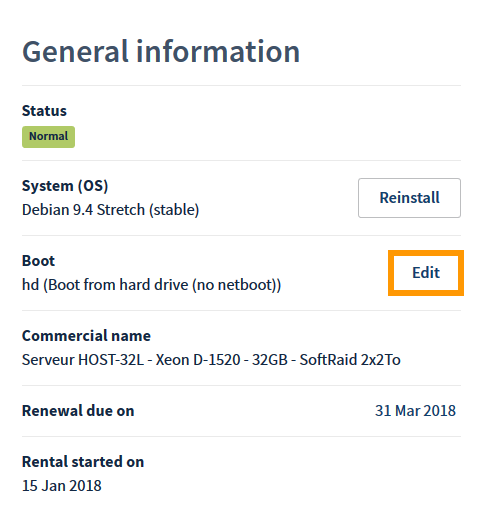
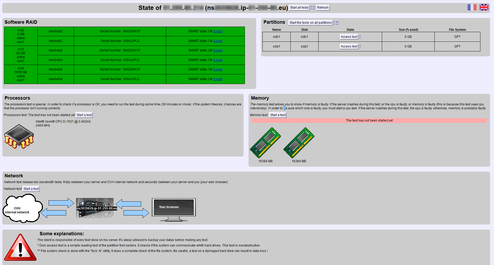
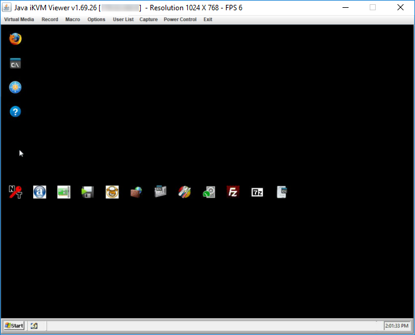

**Last updated 21st June 2018**

## Objective

Rescue mode is a tool on your server that allows you to boot into a temporary operating system for the purpose of diagnosing and resolving issues. 

**This guide will show you how to activate and use your server's rescue mode.**

<iframe width="560" height="315" src="https://www.youtube.com/embed/UdMZSgXATFU?rel=0" frameborder="0" allow="autoplay; encrypted-media" allowfullscreen></iframe>

## Requirements

- a root access to your [Dedicated Server](https://www.ovh.co.uk/dedicated_servers/){.external} via the command line (SSH).


## Instructions

You can activate rescue mode by logging into your [OVH Control Panel](https://www.ovh.com/auth/?action=gotomanager){.external} and going to your server's page. Then go to `Server Status`{.action} > `General information`{.action} >`Boot`{.action} and click the `Edit`{.action} button to change the boot mode.

{.thumbnail}

On the next screen, select `Boot on rescue mode`{.action}. If your server has a Linux based OS, select `rescue64-pro`{.action} from the dropdown list. If you have a Windows server, select `WinRescue`{.action}. Lastly, type your email address in the text field, then click `Next`{.action}.

{.thumbnail}

Confirm your options on the next screen and then reboot your server to apply your changes. Your server will now reboot in rescue mode, and you will receive the credentials for logging in via the email address you provided. To exit rescue mode, simply change the boot mode back to `Boot on the hard disk`{.action}, then reboot your server.

{.thumbnail}


### Linux

- Using the web interface

Once your server has rebooted, you'll receive an email with your rescue mode access credentials. The email will also contain a link to the rescue mode web interface, which will give you access to the following tests:

- Hard Drives: Checks the integrity of the server's hard drives with SMART tests
- Processors: Checks that the server's CPU is functioning normally
- Partitions (State): Performs verification of the drives
- Partitions (File System): Performs verification of the server's file system
- Partitions (Explore): A file browser used to explore your files. It is not possible to edit them with this tool, but you make backup of them
- Memory: Performs a test of the installed RAM. If the RAM is faulty, it will be shown at the end of the test

{.thumbnail}

- SSH (command line)

Once your server has rebooted, you'll receive an email with your rescue mode access credentials. After that, you should access your server via the command line in the usual way, but with the rescue mode root password (from the email we sent you) instead of the regular one.

For example :

```sh
ssh root@IP_of_your_server
root@IP_of_your_server password:
```


Most changes that you want to make to your server via SSH while in rescue mode will require you to mount a partition. This is because rescue mode has it's own (temporary) file system, so any file system changes you make in rescue mode will be lost once you reboot the server back into normal mode.

Mounting partitions is done using the mount command in SSH, but you'll first need to list your partitions so that you can retrieve the name of the partition you want to mount. Please refer to the following code examples:

```sh
rescue:~# fdisk -l

Disk /dev/hda 40.0 GB, 40020664320 bytes
255 heads, 63 sectors/track, 4865 cylinders
Units = cylinders of 16065 * 512 = 8225280 bytes

Device Boot Start End Blocks Id System
/dev/hda1 * 1 1305 10482381 83 Linux
/dev/hda2 1306 4800 28073587+ 83 Linux
/dev/hda3 4801 4865 522112+ 82 Linux swap / Solaris

Disk /dev/sda 8254 MB, 8254390272 bytes
16 heads, 32 sectors/track, 31488 cylinders
Units = cylinders of 512 * 512 = 262144 bytes

Device Boot Start End Blocks Id System
/dev/sda1 1 31488 8060912 c W95 FAT32 (LBA)
```

Once you have the correct name of the partition you want to mount, you can mount it with the command shown below:

```sh
rescue:~# mount /dev/hda1 /mnt/
```

> [!primary]
>
> Your partition will now be mounted, allowing you to perform file system operations.
> 
> If your server has a software RAID configuration, you will need to mount your raid volume (generally /dev/mdX).
>


### Windows

#### Accessing WinRescue

Once your server has rebooted, you'll receive an email with your rescue mode access credentials. To access rescue mode, you'll need to download and install a VNC console, or use the `IPMI` module in your [OVH Control Panel](https://www.ovh.com/auth/?action=gotomanager/){.external}.

{.thumbnail}

#### WinRescue tools

|Tool|Description|
|---|---|
|Freecommander|A file manager with all the standard functionality you would expect.|
|NTPWdi|A user-friendly password manager. It lets you reactivate or change the passwords of user accounts on your server. This tool is very useful in the event of lost credentials, or for the reactivation of a security account.|
|FileZilla|An open source FTP client. It supports SSH and SSLprotocols, and has a clear and intuitive drag and drop interface. It can be used for transferring your data to an FTP server, such as the FTP backup supplied with most of the OVH server models.|
|7-ZIP|A file compression and archiving utility that reads the following formats: ARJ, CAB, CHM, CPIO, CramFS, DEB, DMG, FAT, HFS, ISO, LZH, LZMA, MBR, MSI, NSIS, NTFS, RAR, RPM, SquashFS, UDF, VHD, WIM, XAR and Z. It also allows you to create your own archives in the following formats: z, XZ, BZIP2, GZIP, TAR, ZIP and WIM.|
|Avast Virus Cleaner|An antivirus application with file scanning and cleansing capabilities.|
|ActivNIC|Allows you to reactivate a deactivated network interface card.|
|SRVFirewall|A script that can either activate or deactivate the firewall on your server.|
|SysInternal|A Microsoft software suite comprised of many tools for network maintenance, process management and much more.|
|Virtual Clone Drive|Allows you to mount ISO, BIN, and CCD files in a virtual CD drive.|
|Firefox|A web browser.|
|Testdisk|A powerful data recovery application. It allows you to recover and modify corrupted partitions, find lost partitions, repair a boot sector or even reconstruct a defective MBR.|

## Go further

Join our community of users on <https://community.ovh.com/en/>.