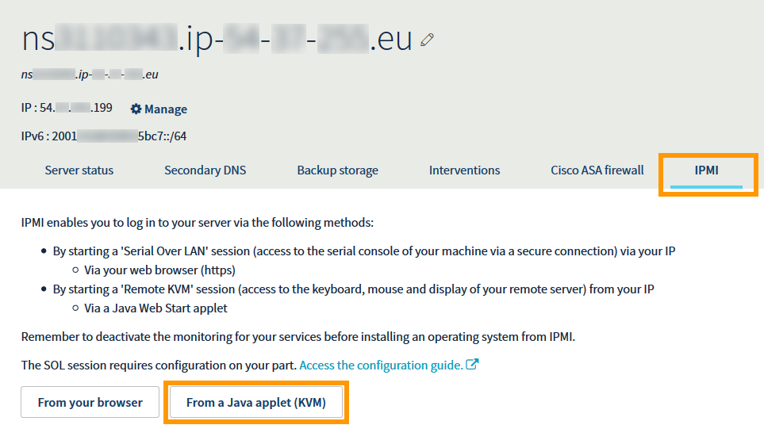
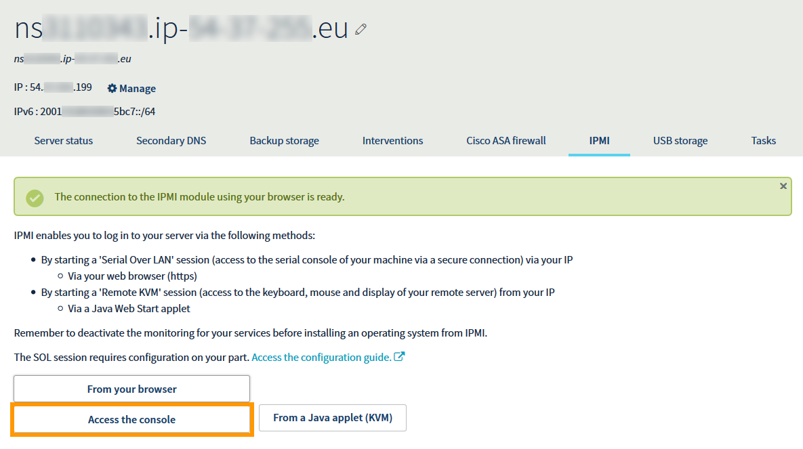

**Last updated 16th July 2018**

## Objective

With the IPMI (Intelligent Platform Management Interface) console, you can access your dedicated server directly, without needing to use any external software (e.g. a terminal or PuTTY).

**This guide will explain how to access your servers using this console.**

> [!primary]
>
Please note that you may also see the term KVM (Keyboard, Video, and Mouse) used for this solution, in connection with our [VPS](https://www.ovh.co.uk/vps/){.external} products.
>

## Requirements

- access to the [OVH Control Panel](https://www.ovh.com/auth/?action=gotomanager){.external}

## Instructions

You can access the IPMI using two different methods: The Java applet (recommended) or the browser (Serial over LAN).

### Access via the Java applet

You will need to ensure that Java is installed on your desktop for the Java applet to work. If Java is not installed on your desktop, go to the [official page](https://www.java.com/en/download/){.external} to do so.

In the `IPMI`{.action} section of your Control Panel, click on `From a Java applet (KVM)`{.action}:

{.thumbnail}

Download the file `kvm.jnlp` when you are prompted to do so, then click `Run`:

{.thumbnail}

You will then land on the login page, where you will be prompted to enter your `root` credentials, as you would need to when logging in via a terminal or external software application:

{.thumbnail}

You can now manage your server using the IPMI console.

### Access via your browser, using Serial over LAN (SoL)

Although we would recommend that you log in via the Java applet, you can also access the IPMI using Serial over LAN. To do so, click on `From your browser (SoL)` in the `IPMI`{.action} section of your Control Panel.

{.thumbnail}

> [!warning]
>
> It may take several minutes to access the IPMI using SoL, which is why we would recommend using the applet instead.
>

### Testing and rebooting the IPMI

If your IPMI stops responding, you can test it by clicking on `Test IPMI`{.action}:

{.thumbnail}

If everything appears to be normal, as per our example, you may be experiencing a local technical issue (internet connection, local desktop). If the issue is with the IPMI itself, you can reboot it by clicking `Reboot IPMI`{.action}.

{.thumbnail}

It will take several minutes for the IPMI to reboot.

## Go further

Join our community of users on <https://community.ovh.com/en/>.