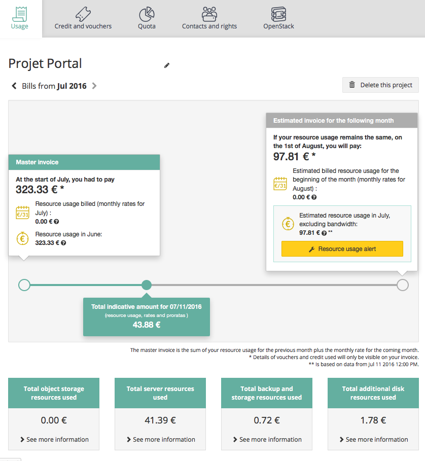

## 
Public Cloud works on a Pay as you Go basis. 
This means it is a flexible solution. 
You can add and remove resources over time (instances, storage, options...) and billing is monthly. 
You can see your estimated invoice in the blink of an eye in your customer account. No surprises at the end of the month!
.

## 
If you do not have an account, go to [this page](https://www.ovh.co.uk/support/new_nic.xml).
You will arrive at an online form. Enter your details and make sure to provide a valid email address.

## Advise:
We suggest that you provide a different email address to your domain name address, as well as a rescue email.
Once you have finished filling out the form, you will receive an email confirming creation. Please keep your customer ID (NIC-handle) and password safe.
Lost your password? Follow [guide]({legacy}2123).
.

## 
Log on to your [customer account](https://www.ovh.com/manager) with your ID.
OVH has a wide range of products available, all of which can be managed via your customer account. Go to the CLOUD universe in the top left.

{.thumbnail}
In this universe, you can create a Public Cloud project.
.

## 
You need a project in order to buy Public Cloud products.
If you have not already accepted the Public Cloud terms and conditions, these will be displayed as below:

{.thumbnail}
Tick the box to accept them.
Enter a project name. You can change it later if you need to.

## Payment method
As explained Public Cloud is a pay as you go service. You can buy instances, storage etc. once the  project is created.
However when you are starting off OVH will ask you to choose one of the three methods. You will only be asked to choose a method for your first project:

- enter payment method

This is the easiest method. You register a payment method and you will automatically be debited at the start of the month. You can't forget to renew!
These methods are available depending on your country:
3D secure, bank account, PayPal.
Please note: if this is your first payment with OVH, we will only offer 3-D Secure.

{.thumbnail}

- buy cloud credit

If you do not have a payment method, you can add cloud credit instead. The first payment is for £30.
This cloud credit will be assigned to your project so that you can add instances, storage etc...
Cloud credit is non transferable or refundable. It has no monetary value and if it is not used within 13 months it will be lost.

{.thumbnail}

- use a Voucher

If you have a promo code, you can add it during this stage. The duration of the voucher may vary.

{.thumbnail}
.

## 
Once you have created your project, it will be available in the left hand menu.

## Add instance or storage
The +Add button lets you launch a Cloud instance in a few seconds among other things.
Follow ([guide]({legacy}1775)) if you need to.

{.thumbnail}

## Manage usage
Via the Project management and resource usage button, you can manage payment methods, vouchers, user rights and analyse your billing.

{.thumbnail}
Estimated invoice example:

{.thumbnail}
Voucher example:

{.thumbnail}

## 
.

