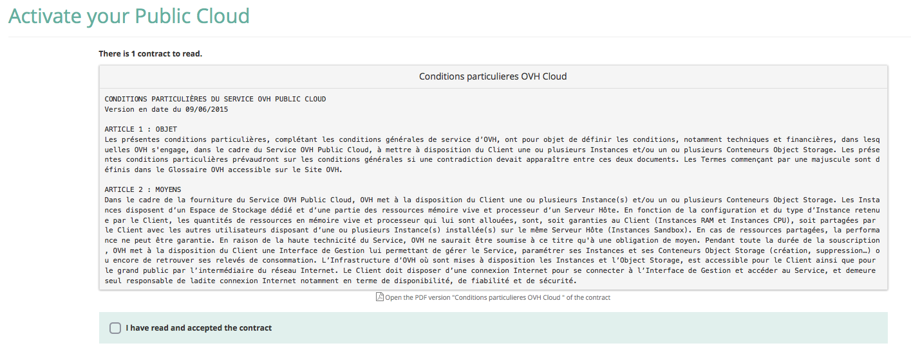

## 
El Public Cloud funciona en base al principio del pago por uso (pay as you go).

Este mecanismo permite ganar flexibilidad, ya que usted puede añadir o eliminar recursos (instancias, almacenamiento, opciones...) a medida que los necesite y recibir la factura cada mes.

En el área de cliente puede consultar la estimación de facturación de un vistazo. Así evitará sorpresas a fin de mes.
 

## 
Si todavía no lo tiene, vaya a la página de [creación de un ID de cliente de OVH](https://www.ovh.es/soporte/new_nic.xml).

Introduzca sus datos en el formulario. Asegúrese de que la dirección de correo electrónico sea válida.

## Consejo:
Le recomendamos que introduzca una dirección de correo electrónico que no tenga su nombre de dominio, así como una dirección de seguridad.
Cuando envíe el formulario, recibirá por correo electrónico un mensaje de confirmación. Anote en un lugar seguro su ID de cliente y contraseña.

## 
Conéctese al [área de cliente](https://www.ovh.com/manager) con su ID de cliente y contraseña.
OVH ofrece un amplio catálogo de productos que podrá administrar desde la misma área de cliente. 

Acceda al universo cloud haciendo clic en el menú «Cloud» de la barra superior.

{.thumbnail}
A continuación vamos a crear un proyecto de Public Cloud.
 

## 
Es necesario crear un proyecto para poder comprar productos de Public Cloud.
Si nunca ha aceptado las condiciones particulares del Public Cloud, estas se mostrarán como en la imagen.

{.thumbnail}
Léalas y acéptelas marcando la casilla.
Introduzca un nombre de proyecto. Más adelante podrá modificarlo si lo desea.

## Forma de pago
Como ya hemos explicado, el Public Cloud se factura por uso. Una vez haya creado el proyecto podrá adquirir instancias, almacenamiento...
Para crear el primer proyecto es necesario elegir una de las siguientes opciones:

Introducir una forma de pago
Es el método más sencillo: registre una forma de pago y a principios del mes siguiente le cargaremos a ella el consumo realizado. ¡Así nunca se olvidará de renovar!

En función del país, pueden estar disponibles las siguientes formas de pago: tarjeta bancaria compatible con 3D Secure, adeudo directo y PayPal.
Importante: Si se trata de su primera compra en OVH, solo aparecerá la opción de tarjeta bancaria 3D Secure.

{.thumbnail}
Adquirir crédito cloud
Si no tiene una forma de pago, puede recargar crédito cloud. El importe mínimo para empezar es de 30 euros.
Dicho crédito cloud se asociará a su proyecto, permitiéndole adquirir instancias, almacenamiento, opciones...

El crédito cloud no es transferible ni reembolsable y no tiene ningún valor monetario. Si no se utiliza en un plazo de 13 meses, se pierde.

{.thumbnail}
Activar un código promocional
Si tiene un código promocional (voucher), puede añadirlo durante esta etapa. La duración y el importe asociados al código promocional pueden variar.

{.thumbnail}
 

## 
Cuando haya creado el proyecto, este aparecerá en el menú izquierdo.

## Añadir una instancia o almacenamiento
Utilice el botón «+ Añadir» para iniciar una instancia cloud en cuestión de segundos.

Si lo necesita, tenemos a su disposición una guía sobre la [creación de instancias](https://docs.ovh.com/es/public-cloud/crear_una_instancia_desde_el_area_de_cliente_de_ovh/).

{.thumbnail}

## Controlar el consumo
Haga clic en «Gestión y consumo del proyecto» para gestionar sus formas de pago, códigos promocionales y permisos de usuario y para analizar su facturación.

Para ello puede consultar [esta guía](https://docs.ovh.com/es/public-cloud/analizar_y_gestionar_la_facturacion/).

{.thumbnail}
Ejemplo de estimación de facturación:

{.thumbnail}
Ejemplo de código promocional:

{.thumbnail}