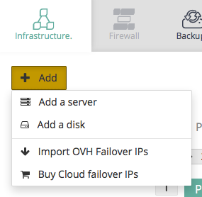

## 
O Public Cloud funciona com o principio de pagamento consoante a utilização (Pay as you Go em Inglês).
Esta filosofia permite ganhar flexibilidade e pode adicionar e eliminar recursos (instâncias, armazenamentos, opções ...) à medida em que vá necessitando deles, recebendo depois a fatura no final de cada mes.

No Espaço de Cliente pode consultar a estimativa de faturação, evitando assim surpresas no final do mês.
 

## 
Se não possui um identificador de cliente basta que aceda à página de [criação](https://www.ovh.pt/suporte/new_nic.xml). Basta que introduza os seus dados, e tenha em atenção ao endereço de e-mail.

## Conselho:
Sugerimos que utilize um endereço de email externo ao seu nome de domínio bem como um endereço de e-mail de segurança.
Assim que terminar de preencher o formulário receberá um e-mail que confirmará a criação da conta. Conserve o seu identificador de cliente (Nichandle) bem como a sua password.
Já possui um identificador de cliente mas perdeu a password? Siga o [guia]({legacy}2123).
 

## 
Com a ajuda do seu identificador aceda ao seu [Espaçoo Cliente](https://www.ovh.com/manager).
A OVH propõe um vasto catálogo de produtos, todos administráveis através de um único Espaço Cliente. Aceda ao universo CLOUD no canto superior esquerdo.

{.thumbnail}
Neste universo vamos então criar um projeto Public Cloud.
 

## 
É necessário que tenha um projeto para que possa adquirir produtos Public Cloud. A aquisição efetua-se após a criação do projeto.
Se nunca aceitou as condições particulares do Public Cloud, elas ser-lhe-ão apresentadas como aqui apresentado:

{.thumbnail}
Elas devem ser lidas e aceites ao selecionar a opção.
Introduza igualmente um nome de projeto. Ele poderá ser mais tarde modificado.

## Método de pagamento
Como explicado, o Public Cloud é faturado por utilização. A aquisição de instâncias, discos ... será efetuado assim que o projeto estiver criado.
Antes de começar, e apenas para o seu primeiro projeto, a OVH requer que escolha um dos seguintes métodos:

- Método 1: introduzir um método de pagamento

Este é o método mais simples. Regista um método de pagamento e será, de forma automática, debitado do valor em dívida no inicio de cada mês. Não há nenhum risco de se esquecer de uma renovação! Métodos de pagamento disponíveis: cartão de crédito compatível com 3D secure e Paypal.
Nota: se é a sua primeira compra na OVH, apenas o cartão de crédito 3D secure será proposto.

{.thumbnail}

- Método 2 : comprar crédito cloud

Se não dispõe de um método de pagamento automático pode adicionar crédito cloud, sendo que o pagamento inicial será de 30 euros.
Este crédito cloud ficará associado ao seu projeto e irá permitir-lhe adquirir instâncias, armazenamentos, opções...
O crédito cloud não pode ser transferido e/ou reembolsado. Não tem qualquer valor monetário e todo o crédito utilizado nos 13 meses subsequentes à sua compra será perdido.

{.thumbnail}

- Método 3 : ativar um Voucher

se dispõe de um código promocional (Voucher), pode adicioná-lo durante esta etapa. A duração da utilização do seu Voucher e o seu montante poderá variar.

{.thumbnail}
 

## 
Assim que o seu projeto estiver criado ele aparecerá no menu à esquerda.

## Adicionar uma instância ou um storage
Através do botão +Adicionar, poderá, por exemplo, iniciar uma instância Cloud em apenas alguns segundos.
Se for necessário pode consultar um guia que a OVH desenvolve: ([guia completo]({legacy}1775)).

{.thumbnail}

## Gerir os meus consumos
Através do botão Gestão e consumo do projeto, poderá gerir os seus métodos de pagamento, vouchers, direitos de utilizadores e analisar a sua faturação.
Efetuámos igualmente um ([guia completo]({legacy}2031)) para o ajudar.

{.thumbnail}
Exemplo de estimação de faturação

{.thumbnail}
Exemplo de um voucher:

{.thumbnail}

## 
Página inicial dos guias [Voltar à pǵina inicial dos guias Cloud]({legacy}1785)

