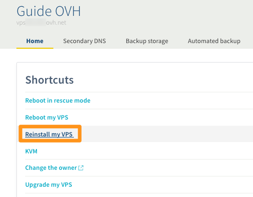

**Last updated 18/04/2018**
 
## Objective

A virtual private server (VPS) is a virtualised dedicated server. Unlike web hosting plans (described as “shared”), which are technically managed by OVH, you are fully responsible for administrating your VPS.

**This guide will give you a few tips to help you manage your newly delivered and installed VPS.**


> [!warning]
>
> OVH is providing you with machines that you will be responsible for. We have no access to these machines, and therefore cannot manage them. You are responsible for your own software and security management. This guide is designed to assist you in common tasks as much as possible. However, we recommend that you call upon a specialised service provider if you experience any issues or doubts when it comes to managing, using or securing your server. You can find more information in the “Go further” section of this guide.
> 


## Requirements

- You need to have reserved your VPS on the [OVH website](https://www.ovh.com/asia/vps/){.external}.
- You need to have received the email with your access ID after the installation (validated during your order).


## Instructions

Once you have logged in to your [Control Panel](https://ca.ovh.com/auth/){.external}, you simply need to read the information about your VPS, go to the `Cloud`{.action} section, then to `Server`{.action} in the left-hand column. In this section, you will see everything about your VPS: general information in the middle, the operations you can perform listed as buttons on the right-hand side of the screen, and options at the very bottom.

### Logging in to a VPS

When you install (or reinstall) your VPS, you will get an email containing your password for root access. Root access lets you connect via SSH to your server. SSH is a secure communication protocol. You can access your server through a command terminal (Linux or MAC) or through third-party software on Windows (e.g.: PuTTy).

Once you have opened the terminal, type the following command to log in to your VPS, replacing the text after the @ symbol with the information required (IPv4 address or VPS reference name):

```sh
ssh root@IPv4_of_your_VPS
```

Or:

```sh
ssh root@your_VPS_reference_name
```

The reference name of your VPS always starts with vpsXXXX.ovh.net (where XXXX is a series of numbers).


### Installing or reinstalling your VPS

You can carry out any reinstallations directly in your Control Panel. Simply click `Reinstall my VPS`{.action}:

{.thumbnail}

A window will open, and you will be asked to choose:

- Your operating system from the drop-down list
- The language
- An SSH key, if you have already created keys in your Control Panel


{.thumbnail}

> [!primary]
>
> Some operating systems or platforms such as Plesk or Windows require a licence to be purchased prior to installation. You can buy this licence from OVH, or from a reseller. You will then need to integrate it manually, or through your Control Panel. You can manage your licences under `Dedicated`{.action}, then `Licences`{.action}.
In this section, you can also order licences (via the `Order`{.action} button on the right), or add your own SPLA Windows or SPLA SQL server licence (via the `Add an SPLA licence`{.action} button on the right).
> 

A progress bar will appear in your Control Panel, for the reinstallation - please note that this can take up to 30 minutes.


### Securing your VPS

As explained in the “Objective” section of this guide, you are the administrator of your VPS. As such, you are responsible for your data and its security.

Please refer to the guide on [Securing a VPS](https://docs.ovh.com/asia/en/vps/tips-for-securing-a-vps/){.external} if you wish to get some basic tips.


### Securing a domain with an SSL certificate

Once you have installed and secured your VPS, you may want to secure your domain name and your website. To do this, you will need to install an SSL certificate, which will allow you to display your website in *https* as opposed to *http* only.

You can install this SSL certificate yourself manually, directly on the VPS. Please refer to the official documentation that you have been using.

## Go further

[Introduction to SSH](https://docs.ovh.com/asia/en/dedicated/ssh-introduction/){.external}

[Securing a VPS](https://docs.ovh.com/asia/en/vps/tips-for-securing-a-vps/){.external}

Join our community of users on <https://community.ovh.com/en/>.