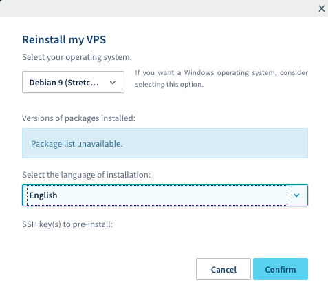

**Laatste update 22-01-2018**
 
## Introductie

Een virtual private server (VPS) is een dedicated virtual server. In tegenstelling tot een webhosting (bijvoorbeeld shared-hosting) waar het technische beheer door OVH wordt verzorgd, beheert u nu volledig uw VPS.

**Deze handleiding zal u enkele tips geven om u te helpen uw nieuw geleverde en geïnstalleerde VPS in eigen hand te nemen.**


> [!warning]
>
> OVH levert machines waarvoor alleen u verantwoordelijk bent. Wij hebben geen toegang tot deze machines, wij zijn dan ook niet de beheerders. Het is aan u om het softwarebeheer en de beveiliging voor het dagelijks gebruik ervan te verzekeren. Wij stellen u deze handleiding ter beschikking om u zo goed mogelijk te begeleiden bij deze dagelijkse taken. We raden we u echter aan om een gespecialiseerde dienstverlener in te schakelen als u moeilijkheden ondervindt of twijfels heeft over het beheer, het gebruik of de beveiliging van een server. Meer informatie in het gedeelte ‘Verder’ in deze handleiding.
> 


## Vereisten

- U moet uw VPS gereserveerd hebben op de OVH-website: <https://www.ovh.nl/vps/>. 
- U moet de e-mail met uw ID hebben ontvangen na de installatie (gevalideerd tijdens uw bestelling).


## Instructie

Nadat u bent ingelogd op uw [Control Panel](https://www.ovh.com/auth/?action=gotomanager), hoeft u alleen maar de informatie over uw VPS te lezen, naar het `Cloud`-gedeelte te gaan en vervolgens naar `Servers`in de linkerkolom. In dit gedeelte ziet u alles over uw VPS: algemene informatie in het midden, de bewerkingen die u kunt uitvoeren weergegeven als knoppen aan de rechterkant van het scherm, en opties onderaan.

### Log in op uw VPS

Wanneer u uw VPS installeert (of opnieuw installeert), ontvangt u een e-mail met een wachtwoord voor root-toegang, de verbinding die het SSH-protocol gebruikt. De SSH is een beveiligd communicatieprotocol. De toegang verloopt via een terminal (Linux of MAC) of met de tussenkomst van een derde softwarepakket op Windows (bijvoorbeeld Putty).

Nadat u de terminal hebt geopend, typt u het volgende commando om u in te loggen op uw VPS:

```sh
ssh root@IPv4_van_uw_VPS
```

Of:

```sh
ssh root@Referentie_van_uw_VPS
```

De referentie van uw VPS begint altijd met vpsXXXX.ovh.net (waarbij XXXX een cijferreeks is).


### (Her)installeer uw VPS

Alle herinstallatie gebeurt rechtstreeks in uw Control Panel. Het is voldoende om hiervoor op de knop `Mijn VPS herinstalleren`{.action} te klikken:

{.thumbnail}

Er opent zich een venster waar u het volgende kunt kiezen:

- Uw besturingssysteem uit de drop-down lijst
- De taal:
- Een SSH-key, als u al keys hebt gecreëerd in uw Control Panel.


{.thumbnail}

> [!primary]
>
> Sommige distributies zoals Plesk of Windows vereisen vooraf een licentie die u, of bij OVH, of bij een andere leverancier kunt aanschaffen. Vervolgens moet u het handmatig, of via uw Control Panel integreren. U kunt uw licenties beheren in `Dedicated`{.action} vervolgens `Licenties`{.action}. Op deze plek kunt u ook licenties bestellen (knop rechts `Bestellen`{.action}) of uw eigen Windows SPLA of SQL SPLA Server licentie (knop rechts `Een SPLA licentie toevoegen`{.action}).
> 

Er verschijnt een voortgangsbalk in uw Control Panel, die de voortgang van de herinstallatie aangeeft, dit kan 30 minuten in beslag nemen:

{.thumbnail}


### Beveilig uw VPS

Zoals eerder aangegeven in het gedeelte 'Introductie' van deze handleiding, bent u de beheerder van uw VPS. U bent verantwoordelijk voor de gegevens en de beveiliging ervan.

Raadpleeg zo nodig de handleiding over de [beveiliging van een VPS](https://docs.ovh.com/nl/vps/tips-beveiliging-vps/) als u een basisuitleg wenst.


### Beveilig uw domein met een SSL-certificaat

Wanneer uw VPS geïnstalleerd en beveiligd is, dient u uw domeinnaam en uw site te beveiligen. Dat vereist de installatie van een SSL-certificaat, die ervoor zorgt dat uw site in *https*, en niet alleen in *http* beschikbaar is.

Dit SSL-certificaat kan door u rechtstreeks handmatig op de VPS worden geïnstalleerd. Raadpleeg hiervoor de officiële documentatie van de distributie die u gebruikt.

Voor een meer geautomatiseerde methode biedt OVH de [SSL Gateway](https://www.ovh.nl/ssl-gateway/). Raadpleeg zo nodig de [commerciële pagina](https://www.ovh.nl/ssl-gateway/){.external} of de [documentatie](https://docs.ovh.com/nl/ssl-gateway/){.external} van dit product.

## Verder

[Introductie tot SSH](https://docs.ovh.com/nl/dedicated/ssh-introductie/){.external}

Ga in gesprek met andere communitygebruikers via <https://community.ovh.com/en/>.