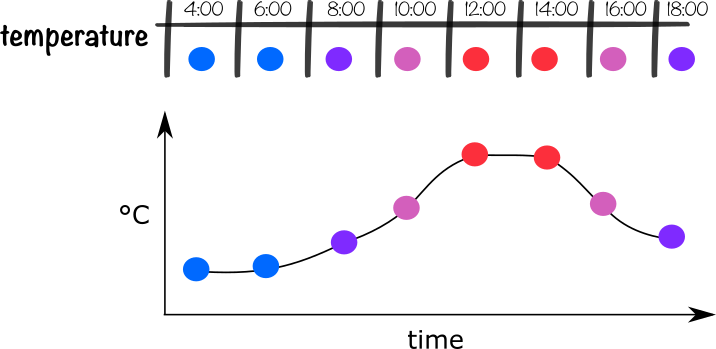

**Last updated 15th May, 2018**

## What are Time series?

> [!primary]
>
> Simply speaking : A Time Series is a sequence of measurements over time.
> 

We call a Time Series, a **sequence** of evolving values over time. These values, named **data points** or **measurements**, are added as they come, with a stable frequency or not.

To ease readability, let's visualise with colors instead of degrees values. We can use the Celcius degree as an Y axis to graph the temperature evolution along the day.

Like in this small example, a graph with a value as an axis, and a time as the second one is just a Time Series visualisation.

## Where can we find Time series?

**Time Series are everywhere**, here are just few examples:

- The evolution of the stock exchange
- The number of calls on a webserver
- The fuel consumption of a car
- The load of a CPU
- The time a customer is taking to register on your website
- The time he spent on your website
- The heart rate of a person measured through a smartwatch

## Time Series data model
In the draw above, we have considered a simple series named **temperature**, but we tend to qualify more our data. There are situations where temperature will not be enough to qualify your series. In a home you could measure temperature at different places like :

- outside
- room 1
- garage
- 1st floor room
- kitchen
- etc.

This why we need **labels** (or tags, dimensions,...) to enhance the data modeling. And now our data model looks like :

All rooms with be a simple value associated with a key *room*.

Labels are key/value pairs used to qualify series. They are **immutable**, which means if you change something in the labels set, it won't affect the previous series but it will create a new one. This also means that your Time Series data model need to be designed carefully (read more on this in the dedicated section).

To consider what should be put into class vs labels, follow our guide on **How to design a good Time Series data model**.

Given the many aspects they can have, the storage, retrieval and analysis of time series cannot be done through standard relational databases, like SQL. Instead it needs a custom built system, not only a Time Series Database, but a whole solution that will enable usability of the data.

We can find here and there many Time Series Databases that claim to solve the same storage system but most of them fail in their mission to provide you the right tools and protocol to let you enjoy your data.

## Time Series Values
Once you have define the good Time Series model for your own need (in the case of monitoring, most of the time your collecting software will choose it for you), you will push data points or measurements.

These data points can be of **multiple types** (Long, Double, String, Boolean)  given the protocol you use. You can refer to the matrix compatibility to know which one fits you best.

## Time Series Analysis
While a common use case for Time Series is to plot them as a graph, using line charts or sparklines, many customers will need to perform custom analysis on their Time Series for domains like :

- Statistics, TopN
- Signal Processing
- Pattern Detection
- Anomaly Detection
- Approximation (like regressions)
- Classification
- Prediction and Forecasting
- etc.

In order to acheive these goals, many **algorithms** can be used. Here is a short selection of most common  features that a customer, looking for **analysis capabilities**, should pay attention to :

|Algorithm|Description|
|---|---|
|Discrete Wavelet Transform (DTW)|Wavelet transformation with temporal resolution|
|Dynamic Time Warping (DTW)|Find similarities between Time Series|
|Signal Smoothing (Moving Average, Exponential, Holt-Winters)|Process signal smoothing using different approach|
|Fourrier Transform (FFT)|Convert a signal into its frequency representation|
|Kernel Smoothing (Cosine, Epanechnikov, Gaussian,...)|Estimaate a value using Nadaraya–Watson kernel regression functions|
|Leat Triangle Three Bucket (LTTB)|Downsample Time Series for visual representation|
|Outlier detection (ESD, Grubbs, STL, Z-score, Thresholds,...)|Detect outliers from a Time Series set|
|Mathematical transformations (Trigonometry, Quaternions,...)|Apply maths operators and functions to values|
|Quantifications & Histograms|Generate quantifications and build histograms to get the value distribution|
|Seasonal Trend Decomposition (STL)|Extract seasonal and trend parts from a Time Series|
|Variance & Standard Deviations|Speak for themselves|

## Time Series Predicton or Forecasting
You can use Time Series to predict the future. By learning from an exsting signal, you can forecast this signal by predicting future points. Using different techniques, like AutoRegressive Integrated Moving Average (ARIMA) for linear models or others (or a combination) more adapted for multivariate Time Series.