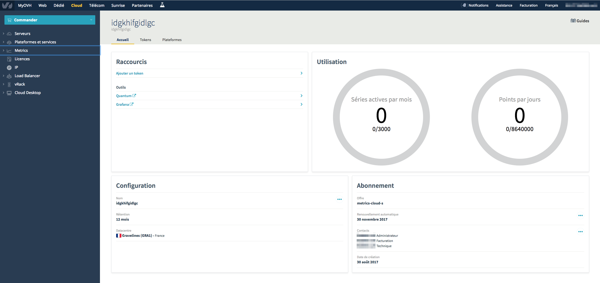

**Last updated 15th May, 2018**

To access your manager, your first need to order a Metrics product.

## Metrics Manager

Let's have a quick tour on the Manager. It's located in the [cloud section](https://www.ovh.com/manager/cloud/index.html){.external} under Metrics section (available when you subscribed a Metrics product).

{.thumbnail}

When in the Metrics section, select your project and you will enter the Metrics manager :

Once the chosen plan has been purchased, go to the `Cloud` section of your control panel. Select the `Metrics` menu from the left side of the control panel.

{.thumbnail}

You can now select your new account from the list on the left.

{.thumbnail}

#### Change name of the account

In the `Configuration` section, click on the dotted button to set up a proper name on your account.

{.thumbnail}

Your account is good to go!

Let's stay on this page for a couple of second to continue the visit.

#### Grab your tokens or create new ones

Now go to the Tokens tab :

{.thumbnail}

Here you can grab two defaults read and write tokens. You can use them or decide to create new ones.

Once done, click to the Platforms tab.

#### Grab your endpoints

Metrics is protocol agnostic. It means you can push with one protocols, and query the same data with another one. 

[Click here, to learn how to used the supported protocols with metrics and their corresponding endpoints](../protocol-overview).

{.thumbnail}