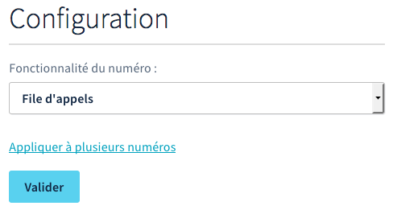
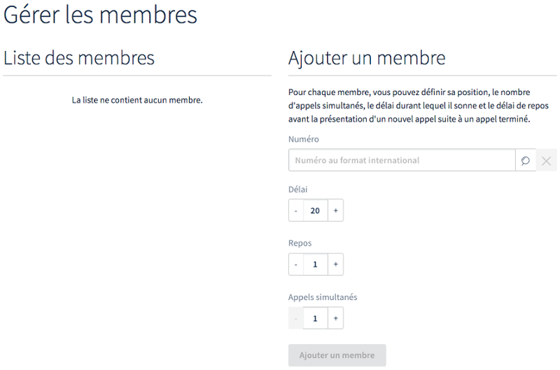
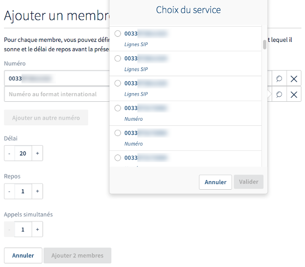
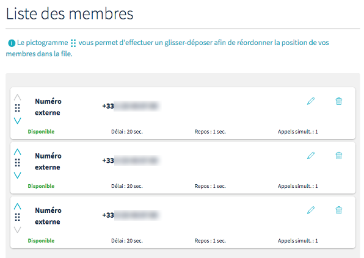
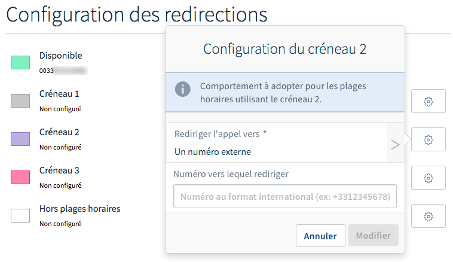
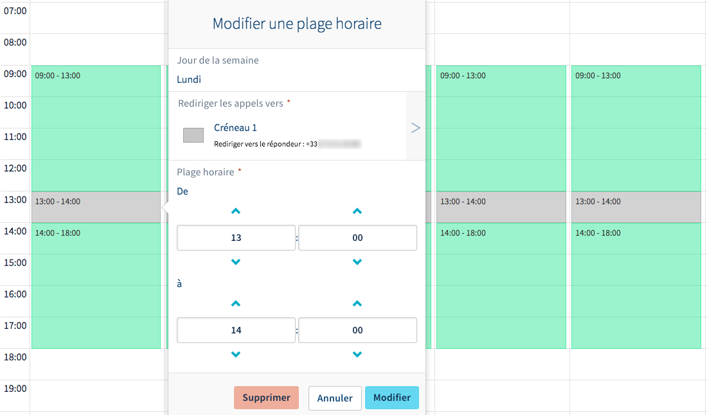

<<<<<<< HEAD
**Dernière mise à jour le 26/07/2018** 
=======
 
**Dernière mise à jour le 18/06/2018** 
>>>>>>> FR_update_plugin-ovh-network
 
## Objectif
 
La configuration en file d'appels du réseau permet de rediriger un appel entrant vers plusieurs lignes. Cette solution rend notamment possible la création d'une stratégie permettant d'éviter la perte d'appels. Elle s'adapte à vos besoins et à votre propre organisation en fonction de ce que vous souhaitez paramétrer.
 
Par exemple, pour un petit support téléphonique, un appel entrant peut être redirigé vers plusieurs collaborateurs ou vers la première ligne disponible qui prendra l'appel.
 
**Apprenez à configurer intégralement une file d'appels sur un numéro alias.**
 
## Prérequis
 
- Disposer d'un [numéro alias](https://www.ovhtelecom.fr/telephonie/numeros/){.external}.
- Disposer d'un accès la gestion du numéro alias depuis l'[espace client OVH](https://www.ovhtelecom.fr/manager/auth/?action=gotomanager){.external} en tant que contact administrateur ou technique.
 
## En pratique
 
### Étape 1 : configurer le numéro en tant que file d'appels
 
Pour débuter la manipulation, connectez-vous à votre [espace client OVH](https://www.ovhtelecom.fr/manager/auth/?action=gotomanager){.external} et assurez-vous de vous situer dans la section `Télécom`. Cliquez sur `Téléphonie`{.action} dans la barre de services à gauche, puis choisissez dans les groupes de facturation qui s'affichent le numéro alias à configurer. Positionnez-vous enfin sur l'onglet `Configuration du numéro`{.action}.
 
{.thumbnail}
 
Cliquez à présent sur le bouton `Modifier le type de numéro`{.action}. Dans le menu déroulant, sélectionnez `File d'appels`{.action}, puis cliquez sur `Valider`{.action}. Patientez quelques instants afin que le changement soit pris en compte.
 
{.thumbnail}

### Étape 2 : configurer la file d'appels
 
Maintenant que le numéro alias est défini en tant que file d'appels, vous pouvez à présent la configurer. Pour cela, cliquez sur le bouton `Gérer les options`{.action}.
 
Sur la nouvelle page qui s'affiche, modifiez la configuration en fonction de ce que vous souhaitez mettre en place. Une fois celle-ci complétée, cliquez sur `Appliquer les changements`{.action}.
 
{.thumbnail}
 
### Étape 3 : gérer les membres de la file d'appels
 
Maintenant que les options de votre file d'appels sont en place, il faut ajouter des membres dans cette dernière. Pour cela, repositionnez-vous sur l'onglet `Configuration du numéro`{.action}, puis cliquez sur `Gérer les membres`{.action}.
 
La page qui apparaît vous permet de visualiser la liste des membres se trouvant dans la file d'appels, de les gérer, et d'en ajouter des nouveaux. 
 
{.thumbnail}
 
#### 1. Ajouter des nouveaux membres
 
Il existe deux possibilités concernant l'ajout d'un membre :
 
- **le numéro concerné est une ligne OVH et est renseigné en tant que contact à votre identifiant client** : cliquez sur l'icône en forme de loupe à droite de la zone de texte, sélectionnez le numéro souhaité, puis cliquez sur `Valider`{.action}. Pour en ajouter plusieurs, cliquez sur le bouton `Ajouter un autre numéro`{.action} et répétez la manipulation autant de fois que nécessaire ;
 
<<<<<<< HEAD
- **le numéro concerné n'est pas une ligne OVH ou n'est pas renseigné en tant que contact à votre identifiant client** : entrez manuellement le numéro au format international (0033 pour la France par exemple) dans la zone de texte. Pour en ajouter plusieurs, cliquez sur le bouton `Ajouter un autre numéro`{.action} pour faire apparaître une nouvelle zone de texte. Sachez que les communications vers un numéro non enregistré chez OVH seront facturées selon [les tarifs en vigueur](https://www.ovhtelecom.fr/telephonie/decouvrez/tarifs_telephonie.xml){.external}.
=======
- **le numéro concerné n'est pas une ligne OVH ou n'est pas renseigné en tant que contact à votre identifiant client** : entrez manuellement le numéro au format international (0033 pour la France par exemple) dans la zone de texte. Pour en ajouter plusieurs, cliquez sur le bouton `Ajouter un autre numéro`{.action} pour faire apparaître une nouvelle zone de texte.
>>>>>>> FR_update_plugin-ovh-network
 
Définissez ensuite trois paramètres supplémentaires pour les numéros sélectionnés précédemment. Si vous souhaitez personnaliser ces valeurs par numéro, vous devrez les ajouter un par un depuis la même interface. 
 
|Paramètres|Détails|
|---|---|
|Délai|Temps de sonnerie sur la ligne (en secondes).|
|Repos|Temps entre le raccroché et la sonnerie de l'appel suivant (en secondes).|
|Appels simultanés|Nombre d'appels que la ligne pourra recevoir.|
 
> [!primary]
>
<<<<<<< HEAD
> Assurez-vous que les paramètres des numéros externes sont en adéquation avec la stratégie de votre file d'appels définie précédemment dans les options. 
> 
> Par exemple, si le délai de sonnerie est supérieur à celui du déclenchement du répondeur, la file d'appels ne pourra plus suivre la configuration de sonnerie prévue. 
=======
> Assurez-vous que les paramètres des numéros externes sont en adéquation avec la stratégie de votre file d'appels définie précédemment dans les options.
> 
> Par exemple, si le délai de sonnerie est supérieur à celui du déclenchement du répondeur, la file d'appels ne pourra plus suivre la configuration de sonnerie prévue.
>>>>>>> FR_update_plugin-ovh-network
>

Une fois les numéros et les paramètres définis, cliquez sur le bouton `Ajouter`{.action}. Les numéros apparaissent alors dans la liste des membres. 
 
{.thumbnail}
 
#### 2. Organiser les membres de la file d'appels
 
Depuis la liste des membres, vous pouvez :
 
- **réordonner les membres dans la file** : pour cela, positionnez votre souris sur le pictogramme représentant six carrés, maintenez le clic puis effectuez un « glisser-déposer » du membre vers sa nouvelle position. Vous pouvez également utiliser les flèches hautes et basses ;
 
- **modifier les paramètres d'un membre de la file** : pour cela, cliquez sur l'icône en forme de crayon, effectuez les modifications souhaitées, puis cliquez sur `Valider`{.action} ;
 
- **supprimer un membre de la file** : cliquez sur l'icône en forme de poubelle, puis sur le bouton `Supprimer`{.action}.
 
{.thumbnail}
 
### Étape 4 : configurer une stratégie d'appels
 
Afin de s'adapter à vos besoins, il est possible de configurer dans le détail une stratégie d'appels. Vous pourrez ainsi affiner les paramètres globaux de la file d'appels ainsi que ceux des membres présents dans cette dernière.
 
Pour rappel, nous vous conseillons d'être vigilant concernant les paramètres que vous souhaitez mettre en place, tant pour la file d'appels que pour les membres qui la composent. Assurez-vous de garder une cohérence globale concernant les paramètres que vous mettez en place. 
 
#### 1. Définir une stratégie d'appels
 
Dans les options de la file d'appels, vous avez la possibilité de définir une stratégie concernant la manière dont les membres de la file vont sonner. Pour la définir ou la modifier, toujours connecté à votre [espace client OVH](https://www.ovhtelecom.fr/manager/auth/?action=gotomanager){.external} et positionné sur le numéro alias concerné, cliquez sur l'onglet `Configuration du numéro`{.action}, puis sur `Gérer les membres`{.action}.
 
Modifiez alors la stratégie en vous aidant des informations ci-dessous :
 
|Stratégie|Détails|
|---|---|
|Selon l'ordre défini des membres|Permet de faire sonner les membres chacun à leur tour, selon l'ordre et les paramètres définis dans la gestion des membres.|
|Selon l'ordre défini des membres, cumulé|Comportement semblable au précédent, excepté que le membre précédent dans la file continuera de sonner.|
|Tous en même temps|Tous les téléphones des membres de la file sonnent en même temps. Le premier qui décroche prend l'appel sur son poste.|
|Selon une répartition de charge|Les téléphones sonneront suivant le temps de disponibilité depuis leur dernier appel : le plus disponible sonnera en premier, le moins disponible en dernier.|
|Le plus ancien à avoir raccroché|Les téléphones sonneront suivant le temps passé depuis le dernier appel raccroché : le membre dont la durée est la plus élevée depuis son dernier appel sonnera en premier.|
|Du plus disponible au moins disponible|Permet de faire sonner les lignes des membres du plus disponible au moins disponible depuis leur activation dans la file d'appels.|
|Aléatoires|Les téléphones sonnent les uns après les autres de manière aléatoire.|

Une fois sélectionnée, cliquez sur le bouton `Appliquer les changements`{.action}. En complément de cette stratégie, assurez-vous que les paramètres définis dans la liste des membres de votre file d'appels sont en adéquation avec la stratégie que vous souhaitez définir.
 
#### 2. Gérer les plages horaires
 
En plus de la stratégie d'appels mise en place, vous pouvez définir plusieurs scénarios en fonction des plages horaires de votre choix. Pour cela, repositionnez-vous sur l'onglet `Configuration du numéro`{.action} puis sur cliquez sur `Gérer les places horaires`{.action}. La page qui apparaît permet de :
 
- activer ou désactiver le système des plages horaires ;
- configurer des scénarios de redirection que vous pourrez utiliser dans vos plages horaires ;
- configurer les plages horaires ainsi que le scénario de redirection à utiliser.
 
Pour débuter, configurez les scénarios de redirection que vous utiliserez ensuite dans vos plages horaires. Dans la partie `Configuration des redirections` de la page, cliquez sur le pictogramme en forme de roue dentée pour configurer les créneaux. Vous devrez y sélectionner ou renseigner un numéro vers lequel les appels seront redirigés. Par défaut, la sélection est positionnée sur « **Un numéro externe** », vous pouvez modifier ce choix en cliquant dessus.
 
> [!warning]
>
> Vous devez impérativement configurer le créneau « **Hors plages horaires** » pour que votre configuration par plages horaires soit fonctionnelle.
>
 
{.thumbnail}
 
Une fois les créneaux configurés à votre convenance, dans la partie `Configuration des plages horaires` de la page, positionnez les créneaux sur les plages horaires que vous souhaitez. Pour cela, deux possibilités de le faire : cliquer sur un horaire et modifier la plage associée ou cliquer sur l'horaire de début souhaité, puis glisser en maintenant le clic jusqu'à l'horaire de fin. Vous devrez valider l'ajout de la plage horaire grâce au bouton `Ajouter`{.action}.
 
Vous pouvez également déplacer des plages existantes. Pour ce faire, cliquez sur ces dernières, et en maintenant le clic, glissez-les dans le tableau des horaires.
 
{.thumbnail}
 
Dès que toutes vos plages horaires sont configurées, cliquez sur le bouton `Valider`{.action} pour sauvegarder ces changements. Vous pouvez également cliquer sur `Appliquer à plusieurs numéros`{.action} pour dupliquer les paramètres sur d'autres files d'appels.
 
Il ne reste plus qu'à activer les plages horaires. Dans la partie `Configuration générale` de la page, cliquez sur `Oui`{.action} puis sur `Valider`{.action}.
 
{.thumbnail}
 
#### 3. Gérer les fermetures exceptionnelles
 
Pour compléter vos plages horaires, vous avez la possibilité de créer des fermetures exceptionnelles qui vous permettront de fermer votre file d'appels sur des plages horaires qui sont normalement considérées comme étant ouvertes. Pour cela, repositionnez-vous sur l'onglet `Configuration du numéro`{.action} puis cliquez sur `Gérer les fermetures exceptionnelles`{.action}. 
 
> [!primary]
>
> Les fermetures exceptionnelles complètent vos plages horaires paramétrées ; il est donc indispensable que ces dernières soient activées pour que les fermetures exceptionnelles s'appliquent.
>

Sur la page qui apparaît, positionnez vos fermetures exceptionnelles sur le calendrier en cliquant sur les jours concernés. Complétez les informations demandées :
 
|Information|Description|
|---|---|
|Plage horaire/journée entière|Choisissez si la fermeture exceptionnelle concerne uniquement une plage horaire ou une journée entière.|
|Objet|Définissez un titre vous permettant d'identifier cette fermeture exceptionnelle dans le tableau.|
|Catégorie|Choisissez un créneau qui permettra de rediriger les appels reçus pendant la fermeture exceptionnelle.|
|Du/au|Définissez la date et l'heure (si nécessaire) de la fermeture exceptionnelle.|
|Description|Vous pouvez ajouter une description plus détaillée à la fermeture exceptionnelle.|
 
Une fois les informations complétées, cliquez sur `Créer l'événement`{.action}. Répétez cette manipulation afin d'ajouter toutes les fermetures exceptionnelles que vous souhaitez créer. Cliquez finalement sur le bouton `Valider`{.action} pour sauvegarder ces changements.
 
Finalement, dans la partie `Paramètres` de la page, assurez-vous que le « **fuseau horaire** » paramétré est correct et que les plages horaires sont activées. Si vous effectuez un changement, cliquez sur le bouton `Valider`{.action} pour le sauvegarder.
 
{.thumbnail}

## Aller plus loin

Échangez avec notre communauté d'utilisateurs sur <https://community.ovh.com>.