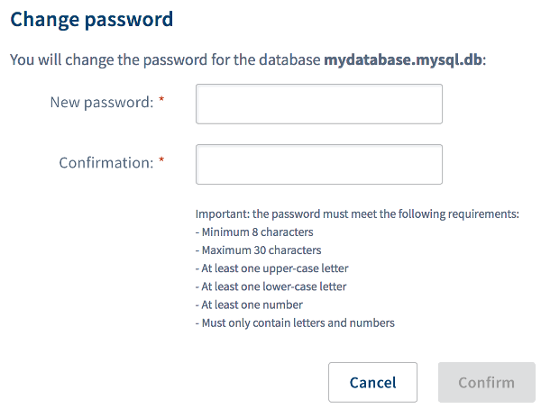

**Päivitetty 6.6.2018**

## Tavoite

Tietokanta (*database* tai DB) mahdollistaa dynaamisiksi kutsuttujen elementtien, kuten kommenttien tai artikkelien varastoimisen. Näitä tietokantoja käyttävät lähes kaikki sisällönhallintajärjestelmät (*Content Management System* tai CMS) kuten WordPress, Joomla! jne. Pääsy tietokantaan tapahtuu siihen liitetyllä salasanalla.

**Opi vaihtamaan webhotellituotteen yhteydessä luodun tietokannan salasana.**

## Edellytykset

- Sinulla on [webhotellituote](https://www.ovh-hosting.fi/webhotelli){.external}.
- Sinulla on pääsyoikeudet webhotellituotteen hallintaan [OVH:n hallintapaneelissa](https://www.ovh.com/auth/?action=gotomanager){.external}.

> [!warning]
>
> Kun muokkaat tietokantasi salasanaa, täytyy muutos siirtää myös konfigurointitiedostoon, joka yhdistää salasanan verkkosivuusi.
>

## Käytännössä

### 1. vaihe: Tilanteen arviointi

**Salasanan vaihtaminen vaatii erityistä varovaisuutta**: pääsy tietokantaa käyttävälle verkkosivulle voi estyä täysin, mikäli muutos on tehty epäasianmukaisesti. Ymmärtämällä muokkauksen vaikutukset, saat paremman käsityksen tehtävästä muutoksesta.

Nykyään lähes kaikki sisällönhallintajärjestelmät (WordPress, Joomla! jne.) käyttävät tietokantaa dynaamisten elementtien kuten kommenttien tai artikkeleiden tallennukseen. Yhteys tietokantaan on siis välttämätöntä näille sivuille, jotta ne voivat toimia kunnolla. Tietokannan tiedot sisältävä konfigurointitiedosto mahdollistaa yhteyden tätä varten. Tästä syystä tietokantasi salasanaa muutettaessa täytyy muutos ehdottomasti siirtää myös konfigurointitiedostoon, joka yhdistää tietokannan verkkosivuusi.

> [!primary]
>
> Ennen muutoksen tekemistä suosittelemme vahvasti tarkistamaan, onko verkkosivusi yhdistetty tietokantaan vai ei. Jos näin on, varmista, että tiedät kuinka muutos siirretään konfigurointitiedostoon. Näin pääsy verkkosivullesi ei esty.
>
> Näiden asetusten määritykset tulevat verkkosivusi konfiguraatiosta eikä OVH:lta, joten suosittelemme ottamaan yhteyttä verkkosivusi kehittäjään tai asiantuntijaan kuten erikoistuneeseen palveluntarjoajaan, mikäli kaipaat apua toimenpiteessä etkä tiedä kuinka toimia.
>

### 2. vaihe: Mene webhotellin tietokantojen hallintaan

Kirjaudu [hallintapaneeliisi](https://www.ovh.com/auth/?action=gotomanager){.external}, klikkaa kohtaa `Webhotellit`{.action} vasemman reunan valikossa ja valitse sitten kyseessä oleva webhotelli. Mene lopuksi välilehdelle `Tietokannat`{.action}.

Näkyviin tulevassa taulukossa on kaikki webhotellituotteen yhteydessä luodut tietokannat.

{.thumbnail}

### 3. vaihe: Tietokannan salasanan muokkaus

Muokataksesi salasanaa klikkaa kolmea pistettä kyseisen tietokannan oikealla puolella ja sitten `Vaihda salasana`{.action}.

{.thumbnail}

Syötä näkyviin tulevassa ikkunassa haluamasi salasana, vahvista se ja klikkaa painiketta `Vahvista`{.action}.

**Muutos astuu voimaan joidenkin minuuttien kuluessa.**

> [!primary]
>
> Turvallisuussyistä kehotamme noudattamaan uuden salasanan valinnan yhteydessä ilmoitettuja ehtoja. Tässä lisäksi salasanoihin liittyvät suosituksemme:
>
> - Älä käytä samaa salasanaa kahdesti.
>
> - Valitse salasana, jolla ei ole yhteyttä henkilötietoihisi (vältä esimerkiksi viittauksia sukunimeesi, etunimeesi tai syntymäpäivään).
>
> - Uusi salasanasi säännöllisesti.
>
> - Älä kirjoita salasanaa paperille tai lähetä sitä sähköpostiosoitteeseesi.
>
> - Älä tallenna salasanojasi verkkoselaimeesi, vaikka selaimesi ehdottaisi sitä.
>

{.thumbnail}

### 4. vaihe: Yhteyden palauttaminen tietokannan ja verkkosivun välille

> [!primary]
>
> Tämä osa voi olla valinnainen, mikäli verkkosivuusi ei ole liitetty tietokantaa.
>

Jos verkkosivusi näyttää viestin, joka ilmoittaa, ettei yhteyttä tietokantaan voida muodostaa, merkitsee tämä sitä, ettei salasananmuutosta ole siirretty verkkosivusi ja tietokantasi yhdistävään tiedostoon.

Jotta verkkosivusi pystyy yhdistämään tietokantaan, löytyy tallennustilastasi tiedosto, joka sisältää siihen tarvittavat tiedot eli käyttäjätunnuksen, salasanan, tietokannan nimen ja palvelimen osoitteen. Koska tietokannan salasanaa on muutettu hallintapaneelissa, on tämä yhdyslinkki katkennut.

Yhteyden palauttamiseksi syötä uusi salasana tietokannan tiedot sisältävään tiedostoon. Näiden asetusten määritykset tulevat verkkosivusi konfiguraatiosta eikä OVH:lta, joten suosittelemme ottamaan yhteyttä verkkosivusi kehittäjään tai asiantuntijaan kuten erikoistuneeseen palveluntarjoajaan, mikäli kaipaat apua toimenpiteessä.

## Lue lisää aiheesta

[Lue lisää salasanojen turvallisuudesta Viestintäviraston sivuilta.](https://www.viestintavirasto.fi/kyberturvallisuus/tietoturvanyt/2014/12/ttn201412031257.html){.external}

Viesti käyttäjäyhteisömme kanssa osoitteessa: <https://community.ovh.com/en/>.