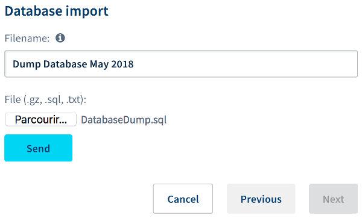
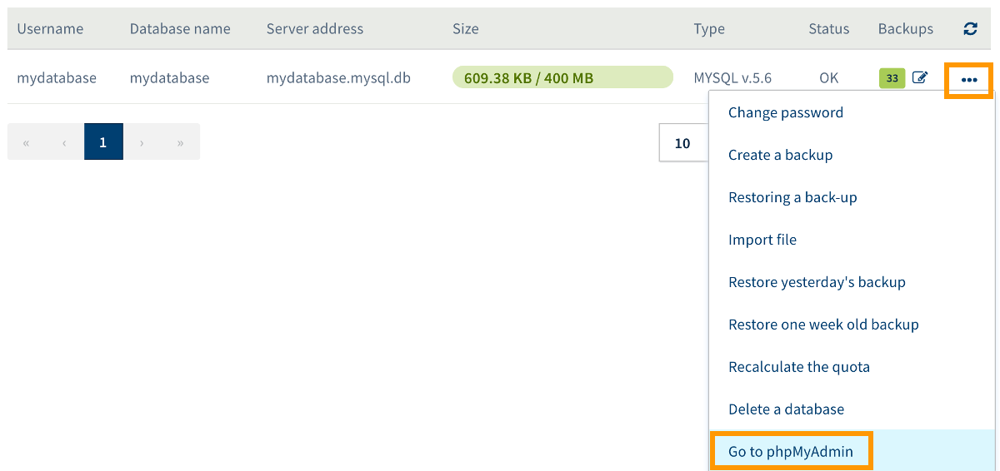

**Päivitetty 26.6.2018**

## Tavoite

Nykyään lähes kaikki sisällönhallintajärjestelmät (WordPress, Joomla! jne.) käyttävät tietokantoja, joilla voidaan tallentaa dynaamisia elementtejä kuten kommentteja tai artikkeleita. Eri syistä johtuen saatat joutua tuomaan tietoja johonkin tietokantaasi muokataksesi tai korvataksesi sen sisältöä.

**Katso, kuinka varmuuskopio tuodaan webhotellisi tietokantaan.**

## Edellytykset

- Sinulla on [webhotellituote](https://www.ovh-hosting.fi/webhotelli){.external}.
- Sinulla on [OVH:n webhotellituotteen](https://www.ovh-hosting.fi/webhotelli){.external} yhteydessä luotu tietokanta.
- Sinulla on varmuuskopio, jonka haluat tuoda tietokantaasi tai pystyt hankkimaan sen.
- Tuontitavasta riippuen sinulla on pääsyoikeudet webhotellituotteesi hallintaan [hallintapaneelissa](https://www.ovh.com/auth/?action=gotomanager){.external} tai tiedot, joiden avulla voit kirjautua tietokantaan.

## Käytännössä

Ennen aloitusta sinun on määritettävä tapa, jolla kyseinen varmuuskopio tuodaan tietokantaan. Siihen on olemassa useita vaihtoehtoja teknisen osaamisesi tasosta riippuen.

- **Tietokannan palauttaminen muutamalla klikkauksella aiempaan päivämäärään**: tämä vaihtoehto palauttaa tietokannan sisällön OVH:n varmuuskopiointityökalussa olevien varmuuskopioiden ansiosta. Tämä vaihtoehto ei edellytä erityistä teknistä osaamista ja sen voi tehdä [OVH:n hallintapaneelissa](https://www.ovh.com/auth/?action=gotomanager){.external}.

- **Oman varmuuskopiotiedostosi tuonti muutamalla klikkauksella**: tämä vaihtoehto tuo oman etukäteen hallussasi olleen varmuuskopiotiedoston tiedot yhteen tietokannoistasi. Tämä vaihtoehto toteutetaan [OVH:n hallintapaneelissa](https://www.ovh.com/auth/?action=gotomanager){.external}.

- **Tuonti phpMyAdmin-käyttöliittymän kautta**: tämä vaihtoehto edellyttää kirjautumista phpMyAdmin-käyttöliittymään toimenpiteen tekemistä varten. Käyttöliittymän käytön osaaminen on siis tarpeellista, jotta tätä vaihtoehtoa voidaan käyttää ja tiedoston koolle on asetettu raja.

- **Tuonnin toteuttaminen skriptiä käyttämällä**: tämä vaihtoehto edellyttää OVH:n webhotellissa ylläpidetyn skriptin luomista tuonnin suorittamiseksi. Erityisosaamista skripteistä tarvitaan.

- **Tuonnin toteuttaminen SSH-komennolla**: tämä vaihtoehto edellyttää kirjautumista datasäilöösi SSH-protokollalla sekä komentojen käyttämistä sen kanssa kommunikointiin. Tämän tyyppisen tavan käyttö edellyttää edistynyttä osaamista sekä tietyn [webhotellituotteen](https://www.ovh-hosting.fi/webhotelli){.external}.

Jotkut yllä mainitut menettelyt eivät tule OVH:n käyttöliittymästä. Sinun on siis tehtävä nämä toimenpiteet oman osaamisesi mukaan. Joitakin tietoja on esitetty alla, mutta ne eivät korvaa webmasterin apua.

Jatka tämän dokumentaation lukemista halutun tuontitavan mukaan.

> [!warning]
>
> OVH tarjoaa käyttöösi palveluja, joiden konfigurointi, hallinta ja vastuu kuuluvat sinulle. Tehtävänäsi on siis varmistaa palvelun kunnollinen toiminta.
>
> Tämän ohjeen tarkoituksena on auttaa sinua yleisimmissä tehtävissä. Suosittelemme ottamaan kuitenkin yhteyttä erikoistuneeseen palveluntarjoajaan ja/tai palvelun kehittäjään, mikäli kohtaat hankaluuksia. Me emme voi tarjota avustusta asiassa. Lisätietoa tämän ohjeen kohdasta “Lisää aiheesta”.
>

### Palauta varmuuskopio hallintapaneelissa

Toimenpiteen tekemiseksi kirjaudu [hallintapaneeliisi](https://www.ovh.com/auth/?action=gotomanager){.external}, klikkaa kohtaa `Webhotellit`{.action} vasemman reunan valikossa ja valitse sitten kyseessä oleva webhotelli. Mene lopuksi välilehdelle `Tietokannat`{.action}.

Näkyviin tulevassa taulukossa on kaikki webhotellituotteen yhteydessä luodut tietokannat. Klikkaa nyt kolmea pistettä aiempaan päivään palautettavan tietokannan kohdalla, klikkaa sitten `Palauta varmuuskopio`{.action}. Huomaa, että tämä toiminto korvaa tietokannan nykyisen sisällön varmuuskopiolla.

{.thumbnail}

Kaikki valitun tietokannan saatavilla olevat varmuuskopiot ovat nyt näkyvissä. Voit nähdä tässä varmuuskopioiden tarkan päivämäärän sekä päivän, jolloin nämä poistetaan OVH:n työkalusta.

Klikkaa kolmea pistettä palautettavan varmuuskopion kohdalla ja kikkaa sitten `Palauta varmuuskopio`{.action}. Varmista, että tiedot ovat oikein näkyviin tulevassa ikkunassa ja klikkaa sitten `Vahvista`{.action}. Odota hetki palautuksen tapahtumista.

{.thumbnail}

### Palauta oma varmuuskopiosi hallintapaneelissa

Toimenpiteen tekemiseksi kirjaudu [hallintapaneeliisi](https://www.ovh.com/auth/?action=gotomanager){.external}, klikkaa kohtaa `Webhotellit`{.action} vasemman reunan valikossa ja valitse sitten kyseessä oleva webhotelli. Mene lopuksi välilehdelle `Tietokannat`{.action}.

Näkyviin tulevassa taulukossa on kaikki webhotellituotteen yhteydessä luodut tietokannat. Klikkaa nyt kolmea pistettä tietokannan kohdalla (sen, johon haluat tuoda tietoja), klikkaa sitten `Tuo tiedosto`{.action}.

{.thumbnail}

Valitse seuraavaksi avautuvassa ikkunassa kohta `Tuo uusi tiedosto`{.action} ja klikkaa sitten `Seuraava`{.action}.

> [!primary]
>
> Painikkeella `Käytä olemassa olevaa tiedostoa`{.action} voit tuoda uudestaan tuontityökaluun jo lähetetyn tiedoston tiedot.
>

{.thumbnail}

Anna tiedoston nimi (tämä mahdollistaa varmuuskopion tunnistamisen myöhemmin, jos haluat palauttaa sen uudestaan) ja valitse sitten kohdan `Tiedosto` vierestä tietokoneellasi oleva tietokannan varmuuskopiotiedosto. Klikkaa sitten `Lähetä`{.action}.

Odota, että käyttöliittymä ilmoittaa lähetyksen onnistumisesta ja klikkaa sitten painiketta `Seuraava`{.action}.

{.thumbnail}

Valitse lopuksi sovelletaanko näkyvissä olevia lisävalintoja vai ei:

- **Tyhjennä nykyinen tietokanta**: kun rastitat tämän ruudun, tietokannan tämänhetkinen sisältö poistetaan kokonaan ja korvataan varmuuskopiolla. Suosittelemme rastittamaan tämän kohdan ainoastaan, jos haluat korvata tietokannan nykyisen sisällön varmuuskopiotiedostolla.

- **Lähetä sähköpostiviesti tuonnin päätyttyä**: rastittamalla tämän kohdan saat sähköpostitse ilmoituksen, kun tietokantasi tuominen on suoritettu.

Kun olet tehnyt valintasi, klikkaa painiketta `Vahvista`{.action}, odota sitten tuonnin päättymistä.

{.thumbnail}

### Tuominen phpMyAdmin-verkkokäyttöliittymän kautta

Tämän toimenpiteen toteuttamiseksi sinun on kirjauduttava phpMyAdmin-käyttöliittymään. Kirjaudu [hallintapaneeliisi](https://www.ovh.com/auth/?action=gotomanager){.external}, klikkaa kohtaa `Webhotellit`{.action} vasemman reunan valikossa ja valitse sitten kyseessä oleva webhotelli. Mene lopuksi välilehdelle `Tietokannat`{.action}.

Näkyviin tulevassa taulukossa on kaikki webhotellituotteen yhteydessä luodut tietokannat. Klikkaa kolmea pistettä halutun tietokannan oikealla puolella ja sitten `Pääsy phpMyAdminiin`{.action}.

{.thumbnail}

Kun olet phpMyAdmin-sivulla, syötä tietokannan tiedot, valitse alasvetovalikosta pääsy tietokannan nykyisiin tietoihin ja kirjaudu. Kun olet kirjautunut, mene nyt välilehdelle `Import`{.action} ja täydennä pyydetyt tiedot. Muistathan, että varmuuskopiotiedoston koko on rajoitettu.

> [!warning]
>
> Koska phpMyAdmin-käyttöliittymä ei ole OVH:n luoma, sinun on toteutettava tämä menettely oman osaamisesi mukaan. Suosittelemme ottamaan kuitenkin yhteyttä erikoistuneeseen palveluntarjoajaan ja/tai käyttöliittymän kehittäjään, mikäli kohtaat hankaluuksia. Me emme voi tarjota avustusta asiassa.
>

### Varmuuskopion tuominen skriptiä käyttämällä

Toimenpide tapahtuu useassa vaiheessa. Varmista, että hallussasi on varmuuskopiotiedosto, jonka haluat tuoda. Lisäksi tarvitset tiedot, joiden avulla voit kirjautua tuonnin määränpäänä olevaan tietokantaan (käyttäjänimi, salasana, tietokannan nimi sekä palvelimen osoite).

> [!warning]
>
> Tämä vaihtoehto on tekninen ja edellyttää ohjelmointiosaamista. Joitakin menettelyä koskevia tietoja on esitelty alla. Suosittelemme ottamaan kuitenkin yhteyttä erikoistuneeseen palveluntarjoajaan, mikäli kohtaat hankaluuksia. Me emme voi tarjota avustusta asiassa.
>

#### 1. vaihe: Tuontiskriptin luominen

Ensimmäisessä vaiheessa luodaan skripti, jolla tuonti voidaan toteuttaa tietokantaan. Alla on näkyvissä esimerkkiskripti, jota voit käyttää apuna tässä toimenpiteessä. Se ei kuitenkaan korvaa webmasterin apua.

```php
<?php
system("cat varmuuskopiotiedoston_nimi.sql | mysql --host=palvelimen_osoite --user=kayttäjänimi --password=käyttäjän_salasana tietokannan_nimi");
?>
```

Korvaa huolellisesti tässä skriptissä näkyvät yleiset tiedot tietokantasi tiedoilla käyttäen apuna alla olevia elementtejä. Kun skripti on valmis, suosittelemme nimeämään sen esimerkiksi nimellä “import.php”.

|Tiedot|Korvaava tieto|
|---|---|
|varmuuskopiotiedoston_nimi|Varmuuskopiotiedoston nimi, joka halutaan tuoda.|
|palvelimen_osoite|Palvelimen osoite, jonka tietokannalle tiedot tuodaan.|
|käyttäjänimi|Käyttäjänimi koskien käyttäjää, jolla on pääsyoikeudet tietokantaan.|
|käyttäjän_salasana|Aiemmin mainitun käyttäjänimen salasana.|
|tietokannan_nimi|Kyseessä olevan tietokannan nimi.|

#### 2. vaihe: Skriptin lataus ja tallennus tallennustilaan

Kun tuontiskripti on luotu, sinun on ladattava se sekä varmuuskopiotiedosto, jonka haluat tuoda webhotellisi tallennustilaan. Sitä varten sinun on kirjauduttava webhotelliisi. Jos et tiedä, kuinka se tapahtuu, katso dokumentaation “Verkkosivun siirto verkkoon” vaihetta 2 nimeltä “[Kirjaudu tallennustilaasi](https://docs.ovh.com/fi/hosting/verkkosivun-siirto-verkkoon/#2-kirjaudu-tallennustilaasi){.external}”.

Jotta voit suorittaa vaiheet, lataa tuontiskripti sekä varmuuskopiointitiedosto “www”-kansioon.   **Kehotamme olemaan erityisen tarkkaavainen tuontiskriptin nimen suhteen.** Varmista, ettet tuhoa tallennustilassasi olemassa olevaa samannimistä tiedostoa, kun lataat skriptin. Jos tämän tyyppinen ilmoitus tulee näkyviin, muokkaa juuri luodun skriptin nimeä ja yritä latausta uudelleen.

#### 3. vaihe: Skriptin kutsuminen

Kun tuontiskripti ja varmuuskopiotiedosto on ladattu tallennustilaan, on jäljellä enää menettelyn käynnistäminen. Tätä varten skriptiä täytyy kutsua.

Toimenpiteen toteuttamista varten on kirjauduttava verkkoselaimellasi skriptisi täydelliseen URL-osoitteeseen (esim. mypersonaldomain.ovh/import.php, jos olet antanut skriptisi nimeksi “import.php”). Jos skriptiin syötetyt tiedot ovat oikein, tuonti käynnistyy. Nyt on enää odotettava hetken sen toteutumista. Jos näin ei ole, tarkista skriptiin syötetyt tiedot ja yritä toimenpidettä uudelleen.

Kun tuonti on toteutettu, suosittelemme vahvasti poistamaan varmuuskopiointitiedoston sekä “www”-hakemiston skriptin.

### Tuo varmuuskopiotiedosto SSH-komennolla

Toimenpiteen toteuttamiseksi sinun on käytettävä päätteen kautta annettavia komentoja, jotta voit toimia vuorovaikutuksessa tallennustilasi kanssa.

> [!warning]
>
> Tämän tyyppisen yhteyden käyttämiseen tarvitaan kehittyneempää osaamista. Alla on esitelty joitakin tietoja menettelystä. Suosittelemme ottamaan kuitenkin yhteyttä erikoistuneeseen palveluntarjoajaan, mikäli kohtaat hankaluuksia. Me emme voi tarjota avustusta asiassa.
>

Kun olet kirjautunut tallennustilaasi SSH-yhteydellä, sinun on käytettävä tietokannan tuonnin mahdollistavaa komentoa. Alla on yksi, joka voi auttaa sinua menettelyssäsi. Huomaa, että tuotava varmuuskopiotiedosto on ladattava etukäteen tallennustilaan ja, että komento on lähetettävä päätteelle siirtymällä hakemistoon, jossa tämä sijaitsee.

```sh
cat varmuuskopiotiedoston_nimi.sql | mysql --host=palvelimen_osoite --user=kayttäjänimi --password=käyttäjän_salasana tietokannan_nimi
```

Korvaa komennon yleiset tiedot kyseessä olevan tietokannan tiedoilla. Kun tuonti on toteutettu, suosittelemme vahvasti poistamaan varmuuskopiointitiedoston hakemistosta, johon sen latasit.

## Lue lisää aiheesta

Viesti käyttäjäyhteisömme kanssa osoitteessa: <https://community.ovh.com/en/>.